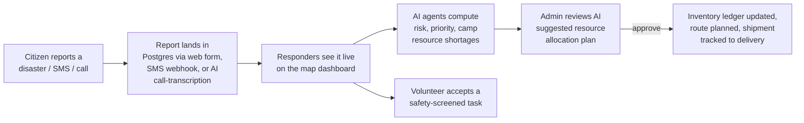
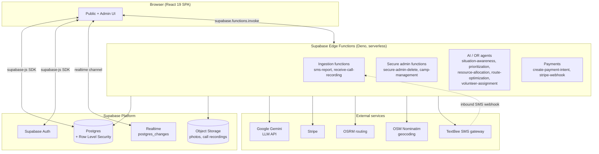
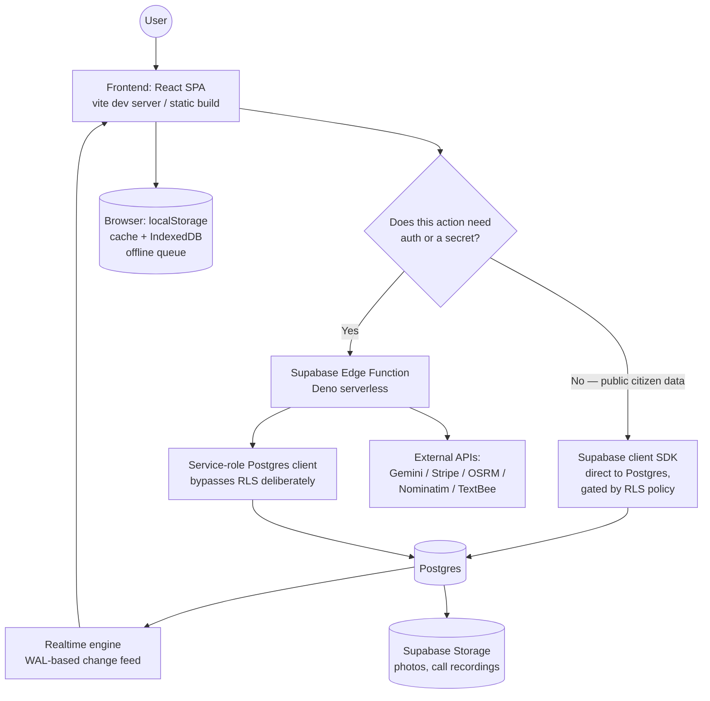
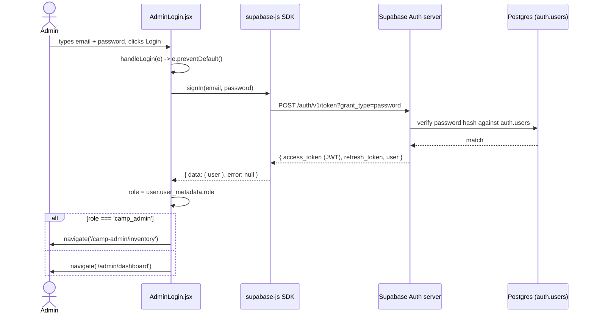
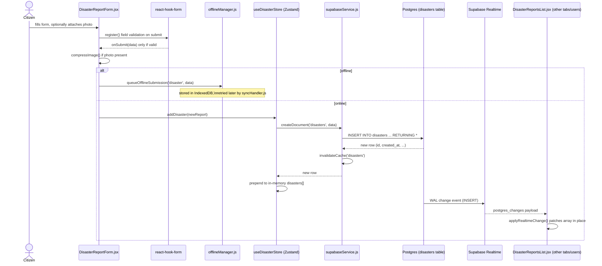
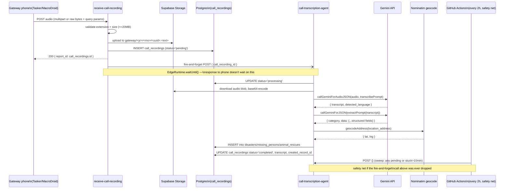
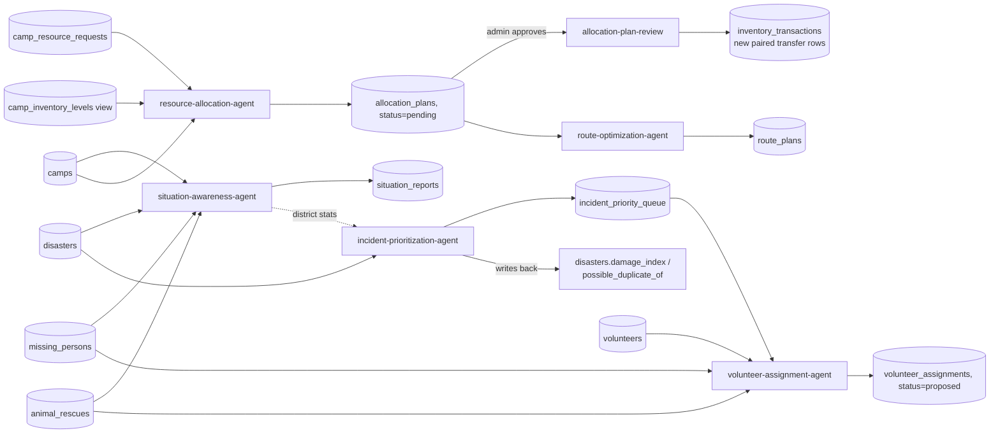
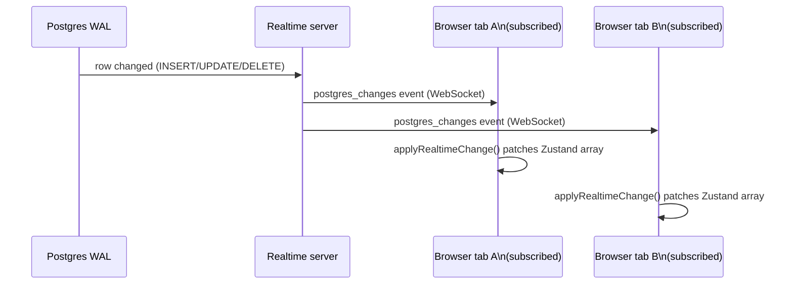

# ResQLink / Hacklite Disaster Management — Project Handbook

### A complete, interview-ready technical mentor's guide to the codebase

*Prepared for the developer who built this project, so they can explain, defend, and discuss every design decision at a senior-engineer interview level.*

---

## How to use this document

This handbook does not assume you remember every line of code. Every time a new concept (a technology, a pattern, an acronym) shows up for the first time, it is explained from first principles before being connected to this project. Real file paths and real function names are used throughout instead of generic examples, so you can jump straight to the source. Two flows are traced in full, function-by-function depth — **admin authentication** and **disaster report submission** — plus one AI-heavy flow, **the call-recording ingestion pipeline**, because it is the most interview-differentiating part of this system. Everything else is covered at "what it is, why it exists, how it connects" depth, which is what you need to defend an architecture, not necessarily recite it.

Every chapter ends with a small mentor box:
> **What to remember** — the one idea an interviewer actually wants to hear.
> **Analogy** — a plain-language comparison.
> **Common confusion** — the thing people get wrong about this topic.

---

# 1. Executive Overview

## 1.1 What problem this project solves

This is a **disaster-management coordination platform** built for Sri Lanka. When a flood, landslide, fire, or other disaster happens, three things need to happen fast, and they normally happen over chaotic phone calls, WhatsApp groups, and spreadsheets:

1. **Reporting** — citizens need a way to report disasters, missing persons, and animals needing rescue, even with bad internet (2G) or no internet (offline queueing) or no smartphone at all (a phone call or SMS).
2. **Response coordination** — responders and admins need a live, map-based view of what's happening, where relief camps are, how full they are, and what supplies are short.
3. **Resource logistics** — once you know camp A has a water shortage and camp B has surplus, someone has to decide how much to move, by what route, and who verifies it actually arrived.

The project's own README calls it a system to move disaster response "from reactive chaos to **proactive, AI-assisted coordination**." Concretely, it is a **React single-page app** (the citizen- and admin-facing website) backed by **Supabase** (a hosted Postgres database + authentication + file storage + realtime + serverless functions platform), with a layer of **Google Gemini AI agents** that read the raw data (reports, camp occupancy, inventory) and produce structured recommendations — never actions — that a human always has to approve.

## 1.2 Who uses it

| User | What they do | Auth model |
|---|---|---|
| **Citizen / reporter** | Reports a disaster, missing person, or animal in danger; donates money; requests a relief camp be set up | No login at all — public forms |
| **Citizen without internet/smartphone** | Calls a hotline (auto-recorded) or sends an SMS | No app — a phone gateway device or SMS gateway app forwards it in |
| **Responder** | Browses live reports on a map, marks cases resolved, sees dashboards | No login (deliberately — see §8) |
| **Volunteer** | Registers skills/location, gets AI-ranked safe tasks to help with directly | No login — identified by a generated ID + phone, matching the "low-stakes, reversible" trust tier |
| **Camp admin** | Manages one specific relief camp's inventory and resource requests | Supabase Auth login, scoped to one `camp_id` |
| **Admin / super-admin** | Reviews everything, runs AI agents, approves resource-allocation plans, deletes bad records | Supabase Auth login, full access |

## 1.3 Main workflow (the "happy path" end to end)



## 1.4 High-level architecture



## 1.5 Technologies involved (at a glance — every one of these is explained in depth in §17)

- **Frontend**: React 19, Vite (build tool), React Router 7, Zustand (state management), react-hook-form, Tailwind CSS, Leaflet/react-leaflet (maps).
- **Backend platform**: Supabase — a hosted wrapper around Postgres that adds Auth, Storage, Realtime, and Edge Functions (Deno-based serverless functions), so this project has effectively no traditional "backend server" of its own to run or scale manually.
- **AI**: Google Gemini (`gemini-flash-lite-latest`) called via raw `fetch`, no SDK — used for language understanding (transcribing calls, extracting structured data from free text, writing short narrative summaries), never for the actual optimization math.
- **Operations Research (the non-AI "smart" part)**: a Hungarian algorithm solver (optimal matching), a Vogel's Approximation Method transportation solver (optimal shipment planning), and a nearest-neighbor + 2-opt TSP solver (route ordering) — all hand-written, dependency-free TypeScript. This is a deliberate design choice explained in §17.
- **Payments**: Stripe, integrated via raw HTTP calls (no Stripe SDK on the server side) plus `@stripe/react-stripe-js` on the client.
- **External data services**: OpenStreetMap Nominatim (free geocoding), OSRM (free road-routing), TextBee (SMS gateway).
- **Scheduling**: GitHub Actions cron (not Supabase's own pg_cron) triggers the AI agent pipeline every 2 hours.

## 1.6 Overall request lifecycle (one sentence version)

A browser talks almost directly to Postgres for reads/writes of citizen reports (secured by Row Level Security policies, not a custom API layer), and talks to short-lived serverless **Edge Functions** for anything that needs a secret, needs to call an external paid API, needs to enforce non-trivial business rules, or needs elevated privileges — the Edge Function then uses a privileged "service role" key to do the actual privileged database work. There is no separate Node/Express/Django server process anywhere in this system; "the backend" *is* Supabase's managed Postgres plus a folder of individually-deployed Edge Functions.

> **What to remember**: this system deliberately has **two different ways for the frontend to reach the database**: (1) direct `supabase-js` calls governed by Row Level Security for simple public CRUD, and (2) Edge Function calls for anything privileged, secret, or business-rule-heavy. Knowing *which path a given feature uses and why* is the single most re-usable fact in this whole handbook — it comes up in almost every section below.
> **Analogy**: RLS-protected direct access is like a bank's public lobby ATM — anyone can use it, but the vault door (the actual ledger) only opens for the specific transaction types etched into that ATM's own rules. Edge Functions are like calling a bank teller who checks your ID, applies discretionary judgment, and only then reaches into the vault with a master key.
> **Common confusion**: people assume "serverless" means "no backend logic." It means no *server process you manage* — the business logic still exists, it's just packaged as small, independently-deployed functions instead of one long-running app.

---

# 2. Overall Architecture

This section walks the request path layer by layer, from a user's click down to a database row and back, per the classic stack: **User → Frontend → Auth → API layer → Backend services → Database → Cache → Storage → external services → Response**. Not every layer in that classic list exists in this project in the traditional sense — and *why* it doesn't is itself an important architectural fact to be able to defend.



## 2.1 Layer-by-layer

### User
The literal person: a citizen with a phone browser on a slow connection, a responder at a desk with multiple monitors, or a rural gateway phone that isn't a "user" in the human sense but produces HTTP requests just the same (the call-recording Tasker/MacroDroid device).

### Frontend — React SPA (`src/`)
**Responsibility**: render UI, collect and validate input client-side, decide which data-access path to use (direct DB vs Edge Function), keep a live in-memory cache of the tables the user is looking at.
**Inputs**: user interaction, Supabase Realtime events, environment variables baked in at build time (`VITE_SUPABASE_URL`, `VITE_SUPABASE_ANON_KEY`, `VITE_STRIPE_PUBLISHABLE_KEY`).
**Outputs**: Supabase SDK calls, Edge Function invocations, rendered DOM.
**Why this exists**: a single-page app gives instant navigation and works offline-first (IndexedDB queueing, §13) — important when the target users may be on a 2G connection during a disaster.
**What could replace it**: a server-rendered app (Next.js) would help SEO and first paint, at the cost of needing an actual Node server to run — a bigger operational commitment for a project this size. **Pros of current choice**: zero server to run, cheap hosting (static files on Vercel/Amplify — both configs, `vercel.json` and `amplify.yml`, exist in the repo). **Cons**: no SSR means slower first paint and worse SEO, both low-priority for this use case (people arrive via a shared link during an emergency, not via Google search).

### "Authentication" layer
There is **no separate authentication microservice** — this responsibility is folded entirely into **Supabase Auth**, a built-in part of the platform (see §8 for the full mechanics: JWTs, sessions, `user_metadata`-based roles). The React app's `AuthProvider` (`src/features/auth/AuthProvider.jsx`) is the client-side integration point, not the authority — the authority is Supabase's own auth server, which every Postgres RLS policy and every Edge Function can independently verify a token against.

### "API Gateway" layer
Again, there is **no separate API gateway** (no Kong, no Express router, no custom REST layer). Supabase itself plays this role in two ways:
1. **PostgREST** — Supabase auto-generates a REST-like API directly over your Postgres schema. When frontend code calls `supabase.from('disasters').select('*')`, the `supabase-js` SDK is really constructing an HTTP request against this auto-generated API, which itself enforces RLS.
2. **Edge Function routing** — each deployed function gets its own URL (`https://<project>.supabase.co/functions/v1/<function-name>`); `supabase.functions.invoke('secure-admin-delete', {...})` is a thin wrapper for `fetch` against that URL with the caller's JWT attached automatically.

**Why this exists**: writing and maintaining a hand-rolled REST/GraphQL API layer for ~15 tables would be a large amount of boilerplate CRUD code for very little product value; PostgREST gives that for free, letting the team spend engineering time on the Edge Functions that actually encode business logic (AI agents, payment security, SMS anti-scam screening).
**Pros**: near-zero boilerplate, RLS enforced at the one place that matters (the database), fast to add a new field (just alter the table, the API updates itself). **Cons**: business logic that *should* live server-side can accidentally leak into the frontend if a developer isn't disciplined about which operations need an Edge Function instead of a direct table call — the codebase research surfaced exactly one place where this discipline slipped (`CampRequestForm.jsx` inserts directly into `camp_requests` rather than via an edge function, though that specific table is intentionally public-write anyway).

### Backend Services — Edge Functions (`supabase/functions/`)
**Responsibility**: anything that (a) needs a secret (Gemini API key, Stripe secret key, cron secret), (b) needs to run privileged/service-role database writes that must not be reachable directly by a browser, or (c) encodes multi-step business logic (screening, scoring, optimization) too complex or sensitive for RLS-only enforcement.
**Inputs**: HTTP request (JSON body, multipart form, raw bytes, or query params depending on the caller), a bearer token or app-specific secret header.
**Outputs**: JSON responses; side effects in Postgres (via the service-role key, which bypasses RLS entirely — this is the one legitimate way to "get around" RLS in this system) and in Storage.
**Why this exists instead of one big backend app**: Supabase Edge Functions are **independently deployed, independently scaled, cold-start Deno processes** — closer to AWS Lambda than to an Express app. Twenty of them exist in this repo, each doing one job (§9 lists every one).
**Alternative considered/implicit**: a single Node/Express monolith backend. **Pros of the chosen serverless approach**: no server to patch or scale, pay-per-invocation, natural isolation (a bug in `stripe-webhook` cannot crash `sms-report`). **Cons**: no shared in-memory state between invocations (every "cache" has to be the database itself or the client), duplicated boilerplate (CORS headers, auth checks) across files since there's no shared middleware layer — confirmed in the research: every function defines its own `corsHeaders` object; there is no `_shared/cors.ts`.

### Database — Postgres, via Supabase
Covered in full in §7. In short: **~20 tables**, Row Level Security on all of them, no ORM (raw `supabase-js` query builder on the client, raw SQL-shaped `.from().select()` calls in Edge Functions).

### Cache
There is no server-side cache (no Redis). Caching exists **only in the browser**, at two layers:
1. `src/lib/cacheManager.js` — a `localStorage`-backed cache with a 1-minute TTL, keyed per table, used to show something instantly on page load before the network round-trip finishes.
2. The Zustand stores themselves (`src/store/supabaseStore.js`) act as an **in-memory, session-lifetime cache** — once a table is subscribed to, records live in memory and are patched in place by realtime events rather than being refetched.
**Why no server cache**: at the project's actual scale (a regional disaster-response tool, not a global consumer app), Postgres itself comfortably serves reads directly; a cache layer would be solving a problem this system doesn't yet have (see §14 for exactly when that stops being true).

### Storage — Supabase Storage (object storage, like S3)
Holds citizen-submitted photos (compressed client-side first, see §13) and call recordings (`call-recordings` bucket). Access is governed by Storage's own RLS-like bucket policies.

### Message Queue
There is **no message queue** (no SQS, no RabbitMQ, no Kafka) in the traditional sense. The closest equivalents are:
- **Fire-and-forget HTTP hand-off**: `receive-call-recording` calls `call-transcription-agent` via `fetch(...).catch(...)` wrapped in `EdgeRuntime.waitUntil()` — a "best effort, don't block the response on it" pattern, not a durable queue.
- **The database itself as a work queue**: `call_recordings.status = 'pending'` rows are the actual durable queue — if the fire-and-forget call is dropped, a scheduled sweep (`call-transcription-agent` called with an empty body) picks up any `pending` or stuck-`processing`-for-10-minutes row later. This is a deliberate, low-cost substitute for a real message queue: Postgres rows with a status column, polled on a timer, instead of a dedicated queue product.
- **IndexedDB as a client-side queue**: `src/lib/offlineManager.js` queues form submissions made while offline, and `src/lib/syncHandler.js` drains that queue when connectivity returns.

### Notifications
The only outbound notification channel is **SMS**, via `supabase/functions/_shared/smsSender.ts` (TextBee gateway) — used specifically to tell a missing-person reporter their case was closed (`resolve-missing-person`). There is no email, push notification, or in-app notification system.

### Response back to user
Either a direct Postgres/PostgREST JSON response (for RLS-governed reads/writes), a Realtime `postgres_changes` event pushed over a WebSocket (for live updates other users' actions trigger), or an Edge Function's JSON response.

> **What to remember**: this architecture's defining trait is **"push business logic to the edges, push data access to the database."** There is deliberately no monolithic backend app to reason about — the tradeoff is that "where does this logic live?" has to be answered per-feature (RLS policy? Edge Function? client-side validation?) rather than always being "in the backend."
> **Analogy**: instead of one large post office that handles every kind of mail, this system is more like a set of specialized drop-boxes (each Edge Function) all feeding into the same central sorting warehouse (Postgres), with the warehouse's own security guards (RLS) double-checking anything that comes in through the front door directly.
> **Common confusion**: "serverless" and "no backend" are not the same thing — there is substantial backend logic here (the whole AI agent pipeline, the anti-scam screening, the transportation-problem solver), it's just organized as many small deployable units instead of one process.

---

# 3. Folder Structure

## 3.1 Repository root

| Path | Why it exists | What would break if removed |
|---|---|---|
| `src/` | All React application source | The entire frontend |
| `supabase/` | Database migrations + all Edge Function source, tracked alongside the frontend so backend and frontend changes can be reviewed/deployed together | All backend logic, the AI pipeline, payments, SMS/call ingestion |
| `docs/` | Setup guides and architecture notes (`AI_ARCHITECTURE.md`, `AI_AGENTS_SETUP.md`, `SUPABASE_SETUP.md`, `MISSING_PERSON_CLOSURE_SETUP.md`) — notably, this is also where the **original base `CREATE TABLE` statements** for `disasters`/`missing_persons`/`animal_rescues`/`camps` survive (see §7.1), since they were never captured as tracked migrations | Onboarding docs; in one case, the only remaining record of the base schema |
| `public/` | Static assets served as-is by Vite (favicon, manifest, etc.) | Static asset 404s |
| `.github/` | GitHub Actions workflow that cron-triggers the AI agent pipeline every 2 hours | The AI agents would only ever run when a human manually clicks "Run AI Analysis" in the admin dashboard |
| `.vscode/` | Editor settings shared by the team | Nothing functional — developer convenience only |
| `.claude/` | Claude Code agent configuration for this repo | Nothing functional for the app itself |
| `index.html` | Vite's SPA entry point — the one real HTML file, into which React mounts | The app would not boot |
| `vite.config.js` | Build tool configuration (dev server, build output, plugin registration for React + Tailwind) | The dev server / production build would not run |
| `tailwind.config.js`, `postcss.config.js` | Tailwind CSS's design tokens (colors, spacing) and its PostCSS integration | Utility classes like `bg-slate-100` would stop generating |
| `eslint.config.js` | Lint rules (React hooks correctness, etc.) | No functional impact, but bugs like stale closures in `useEffect` become easier to introduce unnoticed |
| `jsconfig.json` | Enables the `@/` import alias (e.g. `import { useDonationStore } from '@/store/supabaseStore'`) and editor IntelliSense for a plain-JS (non-TypeScript) project | `@/`-style imports would break |
| `vercel.json`, `amplify.yml`, `pre-deploy.sh`/`.ps1` | Deployment configuration for two alternative static hosts (Vercel, AWS Amplify), plus a pre-deploy sanity-check script | Deployment would need to be reconfigured manually on either platform |
| `package.json` / `package-lock.json` | Dependency manifest and exact lockfile | `npm install` would not reproduce the same dependency tree |

## 3.2 `src/` — every folder

| Folder | Purpose | If removed |
|---|---|---|
| `src/app/` | Composition root: `App.jsx` (providers + Suspense boundary) and `routes.jsx` (the entire route table). | The app would have no routing at all — nothing would render past a blank shell. |
| `src/assets/` | Static images (marker icons, backgrounds). | Broken image references in a handful of components. |
| `src/components/` | Cross-feature, reusable UI — organized into `detail/` (shared detail-page kit), `icons/` (hand-rolled SVG icon set, avoiding an icon-library dependency), `layout/` (navbars, layout-route wrappers), `map/` (all Leaflet integration helpers, shared by every feature that shows a map), `ui/` (generic atoms: charts, modals, loaders, sort headers). | Every feature (disasters, missing-persons, animal-rescue, camps) would have to reimplement its own map, detail page, and table styling from scratch — this folder is what keeps five structurally-similar feature verticals looking and behaving like one product. |
| `src/data/` | `sriLankaRegions.js` — the single source of truth for provinces/districts, imported by both the frontend map config and (mirrored) by backend `_shared/districts.ts`. | Every district dropdown and every "which province is this in" computation across the whole app would need a new source of truth, and would risk drifting out of sync with the backend's copy. |
| `src/features/` | **Feature-sliced architecture** — one folder per business domain (`admin`, `animal-rescue`, `auth`, `camps`, `disasters`, `donations`, `inventory`, `missing-persons`, `volunteers`), each typically containing its own `components/`, `pages/`, and `services/`. | This is the core organizing principle of the entire frontend; removing it would mean falling back to organizing by technical type (all forms in one folder, all pages in another) which scales badly past a handful of features — see §3.4 below for why this matters. |
| `src/lib/` | Cross-cutting utilities that are *not* React components: the Supabase client singleton, the CRUD/realtime service layer, caching, offline queueing, image compression, connection-quality detection, Leaflet icon fixes, map configuration. | Every feature would need to reimplement its own Supabase access pattern, its own offline handling, its own caching — this folder is what lets five feature verticals share one data-access strategy. |
| `src/pages/` | Top-level pages that don't belong to one specific feature domain (`RoleSelection` — the landing page, `Dashboard` — a path-based switch powering the `*-list` responder routes, `EmergencyContacts`, `NotFound`, `ReportDashboard`, `RespondDashboard`). | The app would lose its landing page and its two "mode" dashboards. |
| `src/store/` | Zustand state stores — the client-side single source of truth for each table's live data. | Every component would need its own local fetch/subscribe logic; the realtime "shared channel per table" optimization (§13) would be lost entirely. |

## 3.3 `supabase/` — every folder

| Folder | Purpose | If removed |
|---|---|---|
| `supabase/functions/` | All 20 Edge Functions, one folder each, plus `_shared/` for code reused across them (Gemini client, report-extraction prompt logic, scam screening, OR-algorithm solvers, etc.). | No backend logic at all — no AI agents, no secure admin operations, no payments, no SMS/call ingestion. |
| `supabase/migrations/` | ~32 timestamped SQL files, applied in order, that evolve the schema. | The database schema history would be unreproducible from scratch — a fresh Supabase project could not be brought up to the current schema (compounded by the fact that four base tables aren't even in this folder, see §7.1). |
| `supabase/sql/` | **Untracked**, manually-run "paste into the SQL Editor" scripts — some predate and were later superseded by real migrations, some (like the `approve_camp_request`/`reject_camp_request` SQL functions) were never captured as migrations at all. | Would lose a few pieces of schema/RLS history that exist nowhere else in the repo — flagged repeatedly in §7 and §18 as a real gap worth fixing. |
| `supabase/config.toml` | Declares, per function, whether Supabase's platform-level JWT check is skipped (`verify_jwt = false`) — used for every function that's called by something that isn't a logged-in browser (SMS gateway, call gateway, Stripe, GitHub Actions cron). | Functions needing `verify_jwt = false` would reject every legitimate machine caller with a 401, since none of them can present a Supabase user JWT. |

## 3.4 Why feature-sliced (`src/features/*`) instead of type-sliced (`components/`, `pages/`, `services/` at the top level)

This is a real architectural decision worth being able to defend. In a type-sliced layout, adding one field to "disaster reports" touches `pages/DisasterReportForm.jsx`, `components/DisasterCard.jsx`, `services/disasterService.js` — three folders, no locality. In this project's feature-sliced layout, everything about disasters lives under `src/features/disasters/`, so a change to that one domain stays in one place. The tradeoff is the *cross-feature* shared UI (`components/`, `lib/`) needs real discipline to keep genuinely generic — and the codebase mostly succeeds at this (`DetailKit.jsx`, `tableStyles.js` are used identically by four different features), which is exactly the kind of judgment call an interviewer will probe.

> **What to remember**: folder structure mirrors the two real axes of change in this system — "a business domain changed" (→ `features/`) versus "a cross-cutting concern changed" (→ `lib/`, `components/`). Being able to say *why* a file lives where it does is worth more in an interview than reciting the tree.
> **Analogy**: `features/` is like separate departments in a hospital (cardiology, radiology) — each self-contained; `lib/`/`components/` is like the hospital's shared infrastructure (elevators, the paging system) that every department depends on but none of them owns.
> **Common confusion**: people conflate "feature folder" with "microservice." They're both isolation boundaries, but a feature folder still deploys as part of one single frontend bundle — it's an organizational boundary, not a runtime one.

---

# 4. Core Modules Reference

This is a survey, not a line-by-line reading — it exists so you can locate and describe the purpose of any file quickly. The three flows deep-dived function-by-function are in §6.

## 4.1 Frontend — key files

| File | Role |
|---|---|
| `src/main.jsx` | React 19 entry point. Mount order: `StrictMode → ErrorBoundary → BrowserRouter → ThemeProvider → App`. Also calls `startAutoSync()` once at module load to begin draining any queued offline submissions. |
| `src/app/App.jsx` | `AuthProvider → Suspense(fallback=PageLoader) → AppRoutes`. |
| `src/app/routes.jsx` | The entire route table (see §1's route table). Every page except `RoleSelection`/`EmergencyContacts` is `lazy()`-imported for code-splitting (§13). |
| `src/store/supabaseStore.js` | Five Zustand stores (`useMissingPersonStore`, `useDisasterStore`, `useAnimalRescueStore`, `useCampStore`, `useDonationStore`), each shaped `{data, loading, error, unsubscribe, isInitialized}` plus CRUD + subscribe actions. |
| `src/lib/supabase.js` | The one Supabase client instance (`createClient(url, anonKey)`), imported everywhere else. |
| `src/lib/supabaseService.js` | Generic CRUD (`createDocument`/`getDocument`/`getAllDocuments`/`updateDocument`/`deleteDocument`) plus `subscribeToTable()` — the realtime, shared-channel, progressive-loading subscription engine described in §6.2. |
| `src/lib/cacheManager.js` | `localStorage` cache, 1-minute TTL, keyed `disaster_mgmt_cache_${table}`. |
| `src/lib/offlineManager.js` + `syncHandler.js` | IndexedDB offline queue + the drain-on-reconnect logic. |
| `src/features/auth/AuthProvider.jsx`, `authContext.js`, `useAuth.js`, `ProtectedRoute.jsx` | The real auth stack — see §6.1 and §8. |
| `src/features/auth/ThemeContext.jsx` | **Misleadingly named** — despite the folder, this is a pure light/dark theme provider (`localStorage` key `resqlink_theme`), unrelated to authentication. Worth knowing so you don't misdescribe it in an interview. |
| `src/components/detail/DetailKit.jsx` + `src/lib/detailKit.js` | Shared detail-page design system (headers, info cards, timelines, confirm dialogs) used identically by all four report-type detail pages. |
| `src/components/ui/tableStyles.js` + `SortHeader.jsx` | Shared admin-table design system (panel/th/td/button style constants + sortable-column logic) used by every admin table screen. |
| `src/components/map/*` | `LocationPicker.jsx` (geolocation / click-to-place / Nominatim address search), `MapFrame.jsx` (Sri-Lanka-aspect-ratio sizing + manual resize), `HeatmapLayer.jsx` (wraps `leaflet.heat`), `MapInsightsPanel.jsx` (client-derived stat tiles), `MapResizeFix.jsx` (fixes Leaflet's stale-size-in-flex-layout bug), `leafletIconFix.js` (colored marker icons + the classic bundler-breaks-default-icons fix). |

## 4.2 Backend — Edge Function shared utilities (`supabase/functions/_shared/`)

| File | Role |
|---|---|
| `geminiClient.ts` | Raw-`fetch` wrapper around Gemini's `generateContent` REST endpoint. Two entry points: `callGeminiForJSON()` (text-only) and `callGeminiForAudioJSON()` (inline base64 audio + text prompt in one request). **Never throws** — every failure returns `{ok:false, data:null}`, forcing every caller to have a deterministic fallback. 100-second timeout (Supabase Edge Functions get hard-killed around 150s). |
| `reportExtraction.ts` | The channel-agnostic "free text → structured report" pipeline shared by `sms-report` and `call-transcription-agent`. Builds the classification+extraction prompt, calls Gemini, and dispatches the parsed result into the right table via `insertParsedReport()`. |
| `closureScreening.ts` | Deterministic (non-AI, on purpose) pattern matcher that blocks payment-demand / off-platform-contact scam attempts at missing-person case closure. |
| `agentAuth.ts` | The shared dual-mode auth check (admin JWT **or** cron secret) used by every AI/OR agent function. |
| `scoring.ts` | Pure-math, explainable weighted-sum formulas: Damage Index, Risk Score, Priority Score, Shortage Score. |
| `hungarianAlgorithm.ts`, `transportationSolver.ts`, `tsp2opt.ts` | The three real Operations-Research solvers (§17.9). |
| `geocode.ts`, `geo.ts`, `osrmClient.ts` | Nominatim geocoding, Haversine distance, OSRM routing client. |
| `smsSender.ts`, `audio.ts`, `districts.ts`, `resourceCategories.ts`, `taskSkills.ts`, `textSimilarity.ts` | Supporting utilities — outbound SMS, audio validation, the district list (mirrored from the frontend), the 7-category resource taxonomy, the volunteer-skill/hazard vocabulary, Jaccard text similarity for duplicate detection. |

> **What to remember**: `_shared/` on the backend plays the same role `src/lib/` + `src/components/` play on the frontend — cross-cutting logic factored out so ~20 independently-deployed functions don't reinvent Gemini-calling, auth-checking, or geocoding each time.
> **Analogy**: think of `_shared/` as a shared toolbox kept in a hallway that every small workshop (each Edge Function) can borrow from, versus each workshop forging its own hammer.
> **Common confusion**: `_shared/` code is **not itself deployed as a function** — Deno bundles each function together with whatever `_shared` files it imports at deploy time; there's no runtime dependency between functions.

---

# 5. Deep Dive Flow #1 — Admin Login (Authentication)

This is the flow to know cold, because "walk me through how login works" is one of the most common interview questions there is, and this project's answer ("we don't write our own auth") is itself a defensible, senior-level decision.

## 5.1 The concept, explained from zero

**JWT (JSON Web Token)**: a signed string, split into three base64 parts (`header.payload.signature`), that encodes claims like "this is user X, and this token expires at time T." Because it's cryptographically signed by the issuer (here, Supabase's auth server), *anyone* holding the server's public key can verify a JWT is genuine and unexpired without a database round-trip. That's the whole point of JWTs over old-style server-side sessions: verification is a math operation, not a lookup.

**Why this project doesn't hand-roll authentication**: writing your own login system means hashing passwords correctly (bcrypt/argon2, unique salts), storing sessions, handling password reset tokens, rate-limiting brute force, and rotating secrets — every one of which is a place to introduce a security bug. **Supabase Auth** is a managed service that does all of that; the frontend never sees or touches a password hash.

## 5.2 Full call chain — `AdminLogin.jsx`



**Step by step, matching real code:**

1. **`handleLogin(e)`** (local function inside `src/features/admin/pages/AdminLogin.jsx`) — `e.preventDefault()` stops the browser's native form POST/page-reload.
2. **`signIn(email, password)`** — a small local wrapper that calls:
   ```js
   const { data, error: authError } = await supabase.auth.signInWithPassword({
       email: loginEmail, password: loginPassword
   });
   ```
   This is the **entire client-side "login logic."** `supabase.auth.signInWithPassword` sends the credentials over HTTPS to Supabase's hosted `gotrue` auth server (Supabase's open-source auth service, itself just a Postgres-backed JWT issuer), which checks the password hash and, on success, returns an `access_token` (short-lived JWT), a `refresh_token` (long-lived, used to silently mint new access tokens), and the `user` object.
3. **Role-based redirect** — `const role = data.user?.user_metadata?.role;` then `navigate(role === 'camp_admin' ? '/camp-admin/inventory' : '/admin/dashboard')`. Note this is purely a **UX convenience** — it decides which page to *show*, it does not grant any *permission*. Permission is enforced independently, later, by RLS policies and Edge Function checks that re-derive the role themselves from `admin_users`.
4. **Error path** — a failed `signInWithPassword` populates `error` state, rendered in the form; no navigation happens.
5. **Demo login buttons** — two buttons pre-fill known demo credentials (`admin@demo.com` / `campadmin@demo.com`, password `Demo@1234`) and call the same `signIn` function — purely a UX shortcut for evaluators, not a separate code path.

## 5.3 What happens on every subsequent page load — session persistence

`AuthProvider.jsx` runs once per app load:
```js
useEffect(() => {
  supabase.auth.getSession().then(({ data: { session } }) => {
    applyRole(session?.user ?? null);
    setLoading(false);
  });
  const { data: listener } = supabase.auth.onAuthStateChange((_event, session) => {
    applyRole(session?.user ?? null);
  });
  return () => listener.subscription.unsubscribe();
}, []);
```
`getSession()` reads the tokens the SDK already persisted to `localStorage` on login and, if the access token has expired but the refresh token hasn't, the SDK **silently exchanges it for a new one behind the scenes** — this is the JWT refresh-token lifecycle, handled entirely inside `supabase-js`, invisible to application code. `onAuthStateChange` keeps `user`/`role`/`campId` in sync for the lifetime of the tab (login in another tab, token refresh, logout — all flow through this one listener).

**Why role/campId come from `user_metadata` and not a live `admin_users` query**: the code comment is explicit about this — `admin_users` has RLS that only lets an *already-verified* admin read it (a chicken-and-egg problem if you tried to read it to determine whether someone is an admin), and querying it on every page load would add a network round-trip to every navigation. `user_metadata` is embedded **inside the JWT itself** (it's part of the signed payload), so reading it is a pure client-side, zero-network operation.

## 5.4 Route protection

`ProtectedRoute.jsx` (`src/features/auth/ProtectedRoute.jsx`):
```js
const { user, loading } = useAuth();
if (loading) return <PageLoader />;
if (!user) return <Navigate to="/admin/login" replace />;
return children;
```
Wrapped around `AdminLayout` (covering every `/admin/*` route) and directly around `/camp-admin/inventory`. This is a **UX gate only** — it stops a logged-out browser from rendering admin screens and flashing content, but it is *not* the security boundary. The real boundary is server-side: RLS policies check `auth.uid()` against `admin_users`, and every privileged Edge Function independently re-verifies the caller's JWT and admin status (§5.5). A user could disable JavaScript entirely and `ProtectedRoute` would do nothing — but they still could not read or write anything they shouldn't, because Postgres itself refuses.

## 5.5 Two-tier authorization: client-side convenience check vs. server-side real check

This project makes an important, defensible distinction:

- **`adminService.js`'s `checkIsAdmin()`** queries `admin_users` client-side and is explicitly commented as **"a CLIENT-SIDE check for UI purposes only"** — e.g. deciding whether to show a "Delete" button at all.
- **The real authorization** happens inside every privileged Edge Function (`secure-admin-delete`, `secure-camp-registration`, `camp-management`, `allocation-plan-review`), which independently does:
  ```ts
  const { data: { user }, error } = await supabaseAdmin.auth.getUser(token)   // verify JWT is real & unexpired
  const { data: adminUser } = await supabaseAdmin
    .from('admin_users').select('id, email, role, is_active')
    .eq('user_id', user.id).eq('is_active', true).single()                    // verify they're an active admin
  ```
  using the **service-role key**, which bypasses RLS by design (it *is* the "master key" mentioned in the §2 bank analogy) — meaning this check is the *only* thing standing between an authenticated-but-not-admin user and a privileged operation, so it cannot be skipped or trusted to the client.

**Why this two-tier split is correct, not redundant**: hiding a button is a UX nicety that saves a wasted round-trip for a legitimate non-admin user; it is never, by itself, a security control. If the server-side check were removed and only the client-side hide-the-button check remained, anyone could open devtools, call `supabase.functions.invoke('secure-admin-delete', {...})` directly with their own (non-admin) JWT, and the request would need to be rejected by the function itself — which it is, independently.

> **What to remember**: the interview-winning sentence here is *"authorization is enforced twice, on purpose, at two different layers with two different jobs — the client-side check is a UX optimization, the server-side check (inside the Edge Function, using the service-role key) is the actual security boundary."*
> **Analogy**: the client-side admin check is like a "Staff Only" sign on a door — it politely tells most people not to try. The Edge Function's JWT+`admin_users` check is the actual lock on that door, which doesn't care whether you read the sign.
> **Common confusion**: people think RLS *is* the authorization for everything. It's the authorization for *direct table access*. Edge Functions run with the service-role key specifically so they can do things RLS would otherwise block even for a legitimate admin (e.g. deleting a row from a table with no client-facing DELETE policy at all) — so Edge Functions have to re-implement their own authorization checks by hand, they don't inherit RLS's protection "for free," they deliberately bypass it.

---

# 6. Deep Dive Flow #2 — Disaster Report Submission (end to end, with realtime read-back)

## 6.1 Why this flow, and what it demonstrates

This is the platform's most-used path and the best one to demonstrate the "direct-to-database via RLS" side of the architecture (contrast with Flow #3, which demonstrates the "everything through an Edge Function" side).

## 6.2 Sequence diagram



## 6.3 Function-by-function walkthrough

### 6.3.1 The form — `src/features/disasters/components/DisasterReportForm.jsx`

Built on **react-hook-form** (`useForm`). What this library is and why it's used: naive React forms re-render the *entire* form component on every keystroke (each field is `useState`), which gets slow with many fields and causes visible input lag on low-end phones. react-hook-form instead uses **uncontrolled inputs** registered via refs (`register('fieldName', {validationRules})`) — keystrokes update the DOM directly without triggering a React re-render, and validation runs only at submit time (or on blur, depending on config), reading current values straight from the DOM. This project's forms have 10+ fields each (disaster type, severity, casualties, needs checkboxes, description, contact info, location, photo) — exactly the situation where this matters.

```js
const { register, handleSubmit, formState: { errors }, control } = useForm();
```
- Plain fields: `register('contactNumber', { required: 'Phone number is required', pattern: { value: /^[0-9]{10}$/, message: 'Enter valid 10-digit number' } })`.
- The `location` field is not a plain input — it renders the `LocationPicker` map component, which cannot use `register()` directly (there's no single native `<input>` to attach a ref to), so it uses RHF's `Controller` component instead, which bridges any custom component into the form's validation/value system: `<Controller name="location" control={control} rules={{required: 'Location is required'}} render={({field}) => <LocationPicker value={field.value} onChange={field.onChange} />} />`.

**Client-side connection awareness**: `useConnectionQuality()` (from `src/lib/connectionQuality.js`) reads the browser's Network Information API (`navigator.connection.effectiveType`) to detect a 2G/slow connection and, if so, hides the photo upload field and shows a `LiteModeBanner` — a real accessibility-for-disaster-conditions decision, not a generic performance optimization.

**Photo handling**: `compressImage(file, {maxDimension: 1024, quality: 0.6})` (`src/lib/imageCompression.js`) draws the image onto an off-screen `<canvas>`, resizes it, and re-exports as a JPEG at 60% quality *before* it's ever sent anywhere — this can turn an 8MB phone photo into a few hundred KB, which matters enormously both for upload time on 2G and for storage cost.

### 6.3.2 `onSubmit(data)` — the actual submit handler

```js
const onSubmit = async (data) => {
  const newReport = {
    disaster_type: data.disasterType, severity: data.severity, description: data.description,
    people_affected: data.peopleAffected || null, casualties: data.casualties || null,
    needs: data.needs || {}, location: data.location, occurred_date: data.occurredDate || null,
    area_size: data.areaSize || null, reporter_name: data.reporterName,
    contact_number: data.contactNumber, photo: photoPreview, status: 'Active'
  };
  if (!isOnline()) {
    await queueOfflineSubmission('disaster', newReport);
  } else {
    await addDisaster(newReport);
  }
};
```
Two branches, one deliberate resilience feature:
- **Offline branch**: `queueOfflineSubmission('disaster', newReport)` (`src/lib/offlineManager.js`) writes the report into an **IndexedDB** database (`disaster_management_offline`) — a browser-native, structured, transactional object store, chosen over `localStorage` because it can hold larger amounts of structured data (including the base64 photo) without `localStorage`'s ~5-10MB string-only ceiling. `syncHandler.js`'s `startAutoSync()` (started once, in `main.jsx`) listens for the browser's `online` event and drains this queue automatically, mapping `'disaster' → TABLES.DISASTERS` and calling the same `createDocument()` used by the online path.
- **Online branch**: `addDisaster(newReport)` — a Zustand store action.

### 6.3.3 `addDisaster` (Zustand action, `src/store/supabaseStore.js`)

```js
addDisaster: async (disaster) => {
  const newDoc = await createDocument(TABLES.DISASTERS, disaster);
  set(state => ({ disasters: [newDoc, ...state.disasters] }));
  return newDoc;
}
```
Two responsibilities: (1) delegate the actual database write to `supabaseService.js`, (2) **optimistically prepend** the new row to the in-memory array immediately, so the submitting user's own UI updates instantly without waiting for a realtime round-trip.

### 6.3.4 `createDocument` (`src/lib/supabaseService.js`)

```js
export async function createDocument(table, data) {
  const { data: doc, error } = await supabase.from(table).insert([data]).select().single();
  if (error) throw error;
  invalidateCache(table);
  return doc;
}
```
`supabase.from('disasters').insert([data])` is the `supabase-js` query builder constructing a `POST /rest/v1/disasters` request against Supabase's auto-generated PostgREST API. **This request carries the anon public API key, not a privileged one** — it succeeds or fails purely based on the `disasters` table's RLS `INSERT` policy (public-write, per §7.5). `.select().single()` asks PostgREST to return the newly-inserted row (with its server-generated `id`, `created_at`) in the same round-trip, avoiding a second query. `invalidateCache(table)` clears the 1-minute `localStorage` cache entry so a subsequent full page reload doesn't serve stale pre-insert data.

### 6.3.5 Reading it back — realtime, not polling

`DisasterReportsList.jsx` never fetches on a timer and never paginates through an API — it does this once, on mount:
```js
const { disasters, isInitialized, subscribeToDisasters } = useDisasterStore();
useEffect(() => { if (!isInitialized) subscribeToDisasters(); }, [isInitialized, subscribeToDisasters]);
// deliberately no unsubscribe on unmount — keeps the shared channel warm across navigation
```
`subscribeToDisasters()` calls `subscribeToTable(TABLES.DISASTERS, callback)` in `supabaseService.js`, which does something more involved than "open a WebSocket":
1. **Shared channel per table** — a module-level `Map` keyed by table name ensures that if three different components all subscribe to `'disasters'`, they share **one** Supabase Realtime channel (`supabase.channel('disasters_changes').on('postgres_changes', {event:'*', schema:'public', table:'disasters'}, handler)`) instead of opening three redundant WebSocket subscriptions. Supabase Realtime works by having Postgres stream its **Write-Ahead Log (WAL)** — the internal log Postgres already keeps for crash recovery and replication — to a Realtime server, which re-broadcasts relevant row changes to subscribed WebSocket clients. This is why realtime updates are near-instant and don't require any polling.
2. **Progressive loading** — shows a `localStorage`-cached copy instantly (if present and fresh), then loads an initial 30-row chunk, then background-loads the rest in pages of 50 — so a table with thousands of rows doesn't block the first paint.
3. **In-place patching** — `applyRealtimeChange()` handles incoming `INSERT`/`UPDATE`/`DELETE` payloads by mutating the in-memory array directly (splice/replace/filter) rather than re-querying the whole table, which is what makes the live "someone else just reported a fire" experience possible without any polling loop.

Because of this, when the citizen in §6.3.2 submits their report, **every other open browser tab looking at the disasters list — responders, admins, other citizens — receives the new row within roughly a second**, via the same WAL-based push, with zero code in those other tabs doing anything but having already called `subscribeToDisasters()` once.

### 6.3.6 Admin review and resolution

`DisasterReportDetail.jsx` finds the record **client-side** from the already-subscribed array (`disasters.find(d => d.id === id)`) rather than issuing a fresh `getDocument` query — another consequence of the "the store is a live cache of the whole table" design. A responder can click "Mark Resolved," which opens a confirm dialog and calls `markResolvedByResponder(id, resolvedBy, notes)` — a store action that calls `updateDocument('disasters', id, {status: 'Resolved', resolved_at, resolved_by, responder_notes, updated_at})`, a plain `UPDATE` again governed by RLS (not an Edge Function — resolving a report isn't privileged enough to need one). Deleting a bad report, in contrast, **does** go through the `secure-admin-delete` Edge Function (§5.5's pattern) — because a delete is destructive and must be audit-logged, while a status update is reversible and low-risk.

> **What to remember**: this flow is the canonical example of "direct-to-database via RLS," and its defining engineering idea is **realtime as the read model** — the frontend never polls; it subscribes once and lets Postgres's WAL push changes to it, patching an in-memory cache in place.
> **Analogy**: polling is like repeatedly calling a friend to ask "anything new?" Realtime subscription is like giving them your number so they text you the moment something happens.
> **Common confusion**: people assume "realtime" means "no cache is needed." Here it's the opposite — realtime is specifically *what keeps the client-side cache (the Zustand store) valid* without ever needing to be told to refetch.

---

# 7. Deep Dive Flow #3 — The Call-Recording AI Ingestion Pipeline

## 7.1 Why this flow is the best interview showcase

This is the flow that turns "we used Gemini" from a buzzword into a defensible engineering decision. It touches: multipart vs. raw-body HTTP handling, fire-and-forget async hand-off, a durable "database row as queue" pattern, multimodal LLM input (audio, not just text), prompt design with explicit guardrails, and a deterministic fallback for every failure mode. It exists to solve a real accessibility problem: not every citizen in a disaster has a smartphone or data connection, but almost everyone can make a phone call.

## 7.2 The physical setup (context an interviewer will ask about)

A dedicated Android phone is the emergency hotline. Its native dialer auto-records every call to a local folder. A **Tasker/MacroDroid** automation profile (off-the-shelf Android automation apps — not custom Android code) watches that folder and, the moment a recording finishes, HTTP-POSTs it to `receive-call-recording`. This mirrors how the SMS channel works (an off-the-shelf Android SMS Gateway app forwards texts to `sms-report`) — the project deliberately avoids writing and maintaining a custom Android app for either channel.

## 7.3 Sequence diagram — full pipeline



## 7.4 Function-by-function

### 7.4.1 `receive-call-recording/index.ts`

Deliberately **public, unauthenticated** (`verify_jwt = false` in `config.toml`) — the gateway phone has no way to hold a Supabase login, and the endpoint's own header comment states this bluntly: *"anyone who has the URL can upload a recording, no header/token required... the only remaining guardrails are the file-type/size checks; there is no rate limiting."* This is an accepted, documented risk rather than an oversight — see §15 for the tradeoff analysis.

Two body shapes are handled, because two different automation apps feed this endpoint over time:
```ts
if (contentType.includes('multipart/form-data')) {
  // manual/Tasker uploads: true multipart form with an "audio" field
  const audio = formData.get('audio')
  ...
} else {
  // MacroDroid's "File" content body: raw bytes, plain Content-Type,
  // metadata via query params since there are no form fields to read
  const buffer = await req.arrayBuffer()
  audioName = sanitizeMetadata(url.searchParams.get('filename')) || `recording.${extFromMimeType(contentType)}`
  ...
}
```
After validating (`isAllowedAudioExt()`, `MAX_AUDIO_BYTES = 20MB`), it uploads to Storage and inserts a `call_recordings` row with `status: 'pending'`. The **fire-and-forget hand-off**:
```ts
const invokeAgent = fetch(`${supabaseUrl}/functions/v1/call-transcription-agent`, {
  method: 'POST',
  headers: { 'Content-Type': 'application/json', ...(agentCronSecret ? { 'x-agent-cron-secret': agentCronSecret } : {}) },
  body: JSON.stringify({ call_recording_id: row.id }),
}).catch((err) => console.error('Failed to invoke call-transcription-agent:', err))
if (edgeRuntime?.waitUntil) edgeRuntime.waitUntil(invokeAgent)
```
**Why fire-and-forget, and why `waitUntil`**: transcription + two Gemini calls can take many seconds — far longer than the gateway phone's HTTP client should be kept waiting for a "recording received" acknowledgment. `EdgeRuntime.waitUntil(promise)` is a Deno Deploy/Supabase Edge Runtime API that tells the platform "keep this function instance alive briefly to finish this background promise, even though you've already sent the HTTP response" — it decouples *responding to the phone* from *finishing the actual work*.

### 7.4.2 `call-transcription-agent/index.ts`

Two invocation modes, both funneling into the same `processOneRecording(id)`:
1. **Fast path**: `POST {call_recording_id}` (from step 1 above, or a manual admin retry).
2. **Sweep path**: `POST {}` — processes every row that's `status='pending'`, or `status='processing'` for more than `STUCK_PROCESSING_MINUTES = 10` (crash recovery — if the function died mid-processing, the row would otherwise be stuck forever), capped at 20 rows per sweep. This is the GitHub Actions cron's safety net (§9.6).

`processOneRecording()`, step by step:
1. `UPDATE call_recordings SET status='processing'` — a state-machine transition, so a concurrent sweep run won't double-process the same row.
2. Download the audio blob from Storage, convert to base64 (required because Gemini's API accepts inline binary data only as base64-encoded text inside a JSON request body — there is no raw binary upload option for inline data).
3. **Transcription call**:
   ```ts
   const { ok, data } = await callGeminiForAudioJSON<Transcription>(
     audioBase64, mimeType, buildTranscribePrompt(), geminiApiKey
   )
   ```
   This confirms Gemini receives the **audio file directly** — there is no separate speech-to-text (STT) service in this pipeline; a single multimodal model call does both listening and transcribing. The prompt explicitly tells the model this may be a Sri Lankan emergency call mixing Sinhala/Tamil/English and to transcribe verbatim, not translate or summarize, returning `{transcript, detected_language}`.
4. **Extraction call** — a **second, separate** Gemini call, reusing the exact shared function the SMS channel uses:
   ```ts
   const parsed = await callGeminiForJSON<ParsedReport>(
     buildExtractionPrompt(transcript, { sourceLabel: 'phone call transcript', defaultReporterName: 'Call Reporter' }),
     geminiApiKey
   )
   ```
   **Why two separate calls instead of one combined prompt**: separating "transcribe" from "classify and extract structured fields" keeps each prompt focused and reusable — the exact same extraction prompt/logic serves both the call channel and the SMS channel, so a prompt-engineering improvement to one channel automatically benefits the other. It also means a transcription failure and an extraction failure are distinguishable in the `call_recordings.error_message` for debugging.
5. `geocodeAddress(parsed.data.location_address)` via Nominatim (§4.2).
6. `insertParsedReport()` — the shared dispatcher (also used by `sms-report`) that switches on `parsed.category` (`disaster | missing_person | animal_rescue | not_a_report`) and inserts into the matching table, tagging the row `reported_via_call: true, call_recording_id: id`.
7. On success: `UPDATE call_recordings SET status='completed', transcript, detected_language, detected_category, confidence, created_record_id, created_record_table, processed_at`.
8. On **any** thrown error, at any of the above steps: `UPDATE call_recordings SET status='failed', error_message, processed_at` — a single `try/catch` around the whole per-recording pipeline, so a failure never leaves a row silently stuck in `'processing'` for longer than the sweep's 10-minute recovery window.

### 7.4.3 The `'not_a_report'` guardrail (why prompt design here is a real engineering decision, not just wording)

`reportExtraction.ts`'s prompt gives the model an explicit fourth classification option, `not_a_report`, in addition to the three real report types. The code comment cites a concrete incident this was added to prevent: a bank transaction SMS (balance/OTP-style text) was once misclassified and filed as a public disaster report — which is dangerous specifically because `disasters` has a **public-read** RLS policy, meaning a stray bank balance or account number would have been exposed to every visitor of the site. `looksLikeMachineSms()` (a cheap, deterministic regex pre-filter, used only on the SMS channel) catches most of these *before* a Gemini call is even made, saving cost; `not_a_report` is the LLM-side backstop for anything that slips past the pre-filter or arrives via the call channel (which has no equivalent pre-filter, since a phone call is much less likely to be a machine-generated transactional message).

### 7.4.4 What happens if Gemini fails, times out, or is unreachable

Every call into `geminiClient.ts` returns `{ok: false, data: null}` rather than throwing — this is a **contract**, documented in the file's own header comment, that every caller must honor by having a deterministic fallback rather than assuming success. In `call-transcription-agent`, a failed transcription or extraction call simply propagates up as a thrown error from `processOneRecording()`, caught by the outer `try/catch`, resulting in `status: 'failed'` — the recording is preserved (nothing is lost; the audio file and the row both still exist), an admin can see exactly why it failed via `error_message`, and it can be manually retried by re-invoking with the same `call_recording_id`.

> **What to remember**: the interview-ready summary of this whole pipeline is *"a single multimodal LLM call handles transcription, a second call (shared with the SMS channel) handles classification and structured extraction, a deterministic Postgres status column acts as a durable work queue, and a scheduled sweep is the safety net for the fire-and-forget hand-off."* Every failure mode (Gemini down, function crash mid-processing, dropped fire-and-forget call) has an explicit, designed-for recovery path — that's the actual engineering substance here, more than "we called an AI API."
> **Analogy**: think of `call_recordings.status` like a hospital triage whiteboard — `pending` is "not yet seen," `processing` is "a doctor has this patient," `completed`/`failed` are the two ways a case leaves the board. The 10-minute stuck-processing sweep is the charge nurse periodically checking "is anyone marked 'with doctor' who's actually been forgotten?"
> **Common confusion**: people assume "AI agent" here means an autonomous, multi-step reasoning loop (like a LangChain agent deciding its own next action). It doesn't — every "agent" in this codebase (including this pipeline) is a fixed, hand-written sequence of deterministic steps with exactly one or two LLM calls in specific, bounded roles (extract structured data, write a short narrative). The control flow is entirely conventional code, not the LLM's own decisions.

---

# 8. Database

## 8.1 Why Postgres (via Supabase)

**Postgres** is a relational (table-based, SQL) database. The alternative most often raised in interviews is a document database (MongoDB): why not that? This project's data is fundamentally relational — a `disaster` can point at a duplicate `disaster`, an `allocation_plan` must reference a `camp` and an `agent_run` and optionally a `resource_item`, and correctness *depends* on the database enforcing those references (foreign keys, §8.3) and enforcing invariants (CHECK constraints, e.g. "an inventory transaction's quantity is never zero unless it's a count-verification row," §8.4). A document database would push all of that referential and invariant enforcement into application code, which is exactly the class of bug this project's own migration history shows happening even *with* CHECK constraints available (the silently-failing audit log, §8.6, item 24) — the risk would be strictly worse without them. Supabase specifically was chosen because it bundles Postgres with Auth, Storage, Realtime, and Edge Functions as one coherent, mostly-free-tier platform, avoiding the need to separately provision and glue together a database, an auth provider, a file store, and a serverless compute platform.

## 8.2 Schema overview — every table

*(Full grounded detail — every column, type, and originating migration — was produced during research and is preserved as reference material below the summary table. All facts are sourced from `supabase/migrations/*.sql`, cross-checked against `docs/setup/SUPABASE_SETUP.md` and `docs/architecture/CAMPS_TABLE_SCHEMA.md` where the tracked migrations alone were incomplete.)*

| Group | Tables |
|---|---|
| Core citizen reports | `disasters`, `missing_persons`, `animal_rescues`, `camps`, `camp_requests` |
| Donations | `donations` |
| Admin / audit | `admin_users`, `audit_logs` |
| Inventory | `inventory_transactions` (real table, append-only ledger), `camp_inventory_levels` (a **view**, not a table), `camp_resource_requests`, `resource_items` (catalog) |
| Volunteers | `volunteers`, `volunteer_assignments` |
| Call/SMS ingestion | `call_recordings`, `sms_processing_logs` (undocumented in tracked migrations — see §8.6), `outbound_sms_log`, `flagged_closure_attempts` |
| AI agent "blackboard" | `agent_runs`, `situation_reports`, `incident_priority_queue`, `allocation_plans`, `route_plans` |

**An important, verified fact worth stating plainly in an interview**: `disasters`, `missing_persons`, `animal_rescues`, and `camps` have **no tracked `CREATE TABLE` migration** — every file in `supabase/migrations/` for these tables is an `ALTER TABLE`. Their original schema survives only in `docs/setup/SUPABASE_SETUP.md` as a "paste this into the Supabase SQL Editor" manual setup step. This is a real, identifiable gap in migration hygiene (see §18), not a modeling choice — and being able to name it, unprompted, is a strong signal of genuinely understanding your own codebase rather than having memorized a clean-room description of it.

### `disasters` (base + all ALTERs, showing the schema as it stands today)
```sql
-- base (docs/setup/SUPABASE_SETUP.md — not a tracked migration)
CREATE TABLE disasters (
  id UUID DEFAULT gen_random_uuid() PRIMARY KEY,
  disaster_type TEXT NOT NULL, severity TEXT NOT NULL, description TEXT NOT NULL,
  people_affected TEXT, casualties TEXT, needs JSONB, location JSONB NOT NULL,
  occurred_date TIMESTAMP, area_size TEXT, reporter_name TEXT NOT NULL,
  contact_number TEXT NOT NULL, photo TEXT, status TEXT DEFAULT 'Active',
  created_at TIMESTAMP DEFAULT NOW(), updated_at TIMESTAMP DEFAULT NOW()
);
-- + reported_via_sms, sms_sender_phone            (20260101000000)
-- + resolved_at, resolved_by, responder_notes     (20260102000000)
-- + district, damage_index,
--   possible_duplicate_of UUID REFERENCES disasters(id) ON DELETE SET NULL,
--   duplicate_status CHECK (NULL|'flagged'|'confirmed_duplicate'|'confirmed_distinct')  (20260709000001)
-- + reported_via_call, call_recording_id UUID REFERENCES call_recordings(id)  (20260724000000)
```
Notable gap: **`disasters.status` has no CHECK constraint** anywhere in the history — it's free-text with a `'Active'` default, unlike its two siblings below.

### `missing_persons`
Same base shape (`name`, `age`, `gender`, `last_seen_location JSONB`, `last_seen_date`, etc.) plus, over time: `reported_via_sms`/`sms_sender_phone`; `found_at`/`found_by_contact`/`found_notes`; a **CHECK-enforced** `status IN ('Active','Resolved')`; `district`; `reported_via_call`/`call_recording_id`; and (the anti-scam closure work) `resolved_by_name`, `found_person_location`, `found_person_condition` (`CHECK IN ('safe','injured_treated','hospitalised','in_official_care','deceased')`), `authority_contact`, `reporter_notified_at`, `reporter_notification_status` (`CHECK IN ('sent','failed','no_recipient','not_configured')`).

### `animal_rescues`
Same pattern; notable data-lifecycle detail: the base schema defaults `status` to `'Pending'`, but a later migration (`20260102000003`) backfills all legacy `'Pending'`/NULL rows to `'Active'`/`'Resolved'` and *then* adds `CHECK (status IN ('Active','Resolved'))` — meaning the UI-only label `'Pending'` used during a submission is deliberately never the value actually persisted (the `reportExtraction.ts` insert logic comments explicitly on this).

### `camps`
Base (`name`, `type`, `capacity`, `current_occupancy`, `location JSONB`, `facilities JSONB`) plus, over time: `district`/`address`/`latitude`/`longitude`/`managed_by`/`needs jsonb DEFAULT '[]'::jsonb`; a full set of request-parity fields (`ds_division`, `nearby_landmark`, `village_area`, `special_needs`, `contact_email`, `additional_notes`); `source CHECK IN ('admin_direct','public_request')` + `source_request_id → camp_requests(id)`; and, for the inventory system, `inventory_access_code TEXT UNIQUE` + `inventory_thresholds JSONB`. **A documented schema-drift fact**: the tracked migration defines `camps.needs` as `jsonb`, but an *untracked* manual script and one architecture doc both describe it as `TEXT[]` — the tracked migration is authoritative, since it ran first and the untracked script's `ADD COLUMN IF NOT EXISTS` against an already-`jsonb` column would be a no-op.

### `camp_requests` (this one **does** have a tracked `CREATE TABLE`, `002_add_ds_division_to_camp_requests.sql`)
```sql
CREATE TABLE IF NOT EXISTS camp_requests (
  id UUID DEFAULT gen_random_uuid() PRIMARY KEY,
  camp_name VARCHAR(255) NOT NULL, district VARCHAR(100) NOT NULL, estimated_capacity INTEGER NOT NULL,
  address TEXT NOT NULL, nearby_landmark TEXT, latitude DECIMAL(10,8), longitude DECIMAL(11,8),
  facilities_needed TEXT[], reason TEXT NOT NULL, requester_name VARCHAR(255) NOT NULL,
  requester_phone VARCHAR(20) NOT NULL, requester_email VARCHAR(255), additional_notes TEXT,
  status VARCHAR(20) DEFAULT 'pending' CHECK (status IN ('pending','approved','rejected')),
  reviewed_at TIMESTAMPTZ, reviewed_by UUID REFERENCES auth.users(id), rejection_reason TEXT,
  ds_division VARCHAR(100), urgency_level TEXT DEFAULT 'medium' CHECK (urgency_level IN ('low','medium','high','critical')),
  special_needs TEXT, village_area TEXT
);
```

### `donations`
```sql
CREATE TABLE IF NOT EXISTS donations (
  id UUID DEFAULT gen_random_uuid() PRIMARY KEY, donor_name TEXT, donor_email TEXT NOT NULL, donor_phone TEXT,
  is_anonymous BOOLEAN DEFAULT FALSE, amount DECIMAL(10,2) NOT NULL CHECK (amount > 0),
  currency TEXT DEFAULT 'USD' NOT NULL, stripe_payment_id TEXT UNIQUE,
  stripe_payment_status TEXT NOT NULL DEFAULT 'pending', donation_purpose TEXT DEFAULT 'General Relief',
  purpose_category TEXT DEFAULT 'general', purpose_reference_id UUID, message TEXT, admin_notes TEXT,
  distribution_status TEXT DEFAULT 'pending', distributed_at TIMESTAMP, distributed_to TEXT,
  donation_type TEXT NOT NULL DEFAULT 'monetary' CHECK (donation_type IN ('monetary','in_kind')),
  created_at TIMESTAMP DEFAULT NOW(), updated_at TIMESTAMP DEFAULT NOW()
);
```

### Admin / audit — `admin_users`, `audit_logs`
```sql
CREATE TABLE IF NOT EXISTS admin_users (
  id UUID PRIMARY KEY DEFAULT gen_random_uuid(), user_id UUID REFERENCES auth.users(id) ON DELETE CASCADE,
  email TEXT NOT NULL UNIQUE, role TEXT NOT NULL DEFAULT 'admin' CHECK (role IN ('admin','super_admin','camp_admin')),
  is_active BOOLEAN NOT NULL DEFAULT true, camp_id UUID REFERENCES camps(id) ON DELETE CASCADE, -- NULL unless role='camp_admin'
  created_at TIMESTAMPTZ NOT NULL DEFAULT NOW(), created_by UUID REFERENCES auth.users(id), updated_at TIMESTAMPTZ NOT NULL DEFAULT NOW()
);
CREATE TABLE IF NOT EXISTS audit_logs (
  id UUID PRIMARY KEY DEFAULT gen_random_uuid(), admin_id UUID NOT NULL, admin_email TEXT NOT NULL,
  action TEXT NOT NULL CHECK (action IN (
    'DELETE','BULK_DELETE','RESTORE','APPROVE_REQUEST','REJECT_REQUEST','REGISTER_CAMP',
    'REGISTER_CAMP_DIRECT','APPROVE_CAMP_REQUEST','REJECT_CAMP_REQUEST',
    'APPROVE_ALLOCATION_PLAN','REJECT_ALLOCATION_PLAN','DISPATCH_ALLOCATION_PLAN','DELIVER_ALLOCATION_PLAN'
  )),
  table_name TEXT NOT NULL, record_id UUID NOT NULL, record_snapshot JSONB NOT NULL, reason TEXT,
  performed_at TIMESTAMPTZ NOT NULL DEFAULT NOW(), ip_address TEXT, user_agent TEXT
);
```
`record_snapshot JSONB` is the key design idea: **before** a delete, the entire row is captured verbatim into this column — so an accidental or malicious deletion is always recoverable by reading the snapshot back out, even though there is no formal `RESTORE` automation (the `RESTORE` action exists in the CHECK constraint but no code path currently calls it).

### Inventory system
```sql
CREATE TABLE IF NOT EXISTS inventory_transactions (   -- append-only ledger; never UPDATEd or DELETEd
  id UUID PRIMARY KEY DEFAULT gen_random_uuid(), camp_id UUID NOT NULL REFERENCES camps(id) ON DELETE CASCADE,
  item_name TEXT NOT NULL, category TEXT NOT NULL CHECK (category IN ('food','water','medical','shelter','clothing','hygiene','other')),
  unit TEXT NOT NULL DEFAULT 'units',
  transaction_type TEXT NOT NULL CHECK (transaction_type IN ('received','distributed','adjusted','transferred_in','transferred_out','verified')),
  quantity NUMERIC(10,2) NOT NULL,
  CONSTRAINT verified_zero_qty CHECK ((transaction_type='verified' AND quantity=0) OR (transaction_type<>'verified' AND quantity<>0)),
  source_donation_id UUID REFERENCES donations(id) ON DELETE SET NULL,
  source_allocation_plan_id UUID REFERENCES allocation_plans(id) ON DELETE SET NULL,
  item_id UUID REFERENCES resource_items(id) ON DELETE RESTRICT,
  recorded_by_name TEXT, notes TEXT, recorded_at TIMESTAMPTZ NOT NULL DEFAULT NOW()
);

CREATE VIEW camp_inventory_levels AS   -- NOT a table — always computed live from the ledger, never a cached counter
SELECT camp_id, item_id, item_name, category, unit,
  SUM(CASE WHEN transaction_type IN ('received','transferred_in','adjusted') THEN quantity
           WHEN transaction_type IN ('distributed','transferred_out') THEN -quantity
           ELSE 0 END) AS quantity_on_hand,
  MAX(recorded_at) AS last_movement_at
FROM inventory_transactions GROUP BY camp_id, item_id, item_name, category, unit;
GRANT SELECT ON camp_inventory_levels TO anon, authenticated;  -- deliberately public, unlike the raw ledger
```
This is a genuinely good design pattern worth being able to explain: **current stock is never stored, only derived.** There is no `camps.stock_count` column that could drift out of sync with reality; "how much water does Camp 3 have right now" is always a `SUM()` over the immutable transaction history, computed fresh on every read. The tradeoff (discussed in §14) is that this sum gets more expensive as the ledger grows, which is exactly why `idx_inventory_txn_camp_item(camp_id, item_name)` exists.

```sql
CREATE TABLE IF NOT EXISTS camp_resource_requests (
  id UUID PRIMARY KEY DEFAULT gen_random_uuid(), camp_id UUID NOT NULL REFERENCES camps(id) ON DELETE CASCADE,
  item_name TEXT NOT NULL, item_id UUID REFERENCES resource_items(id) ON DELETE RESTRICT,
  resource_category TEXT NOT NULL CHECK (resource_category IN ('food','water','medical','shelter','clothing','hygiene','other')),
  unit TEXT NOT NULL DEFAULT 'units', quantity_requested NUMERIC(10,2) NOT NULL CHECK (quantity_requested > 0),
  quantity_fulfilled NUMERIC(10,2) NOT NULL DEFAULT 0 CHECK (quantity_fulfilled >= 0),
  urgency TEXT NOT NULL DEFAULT 'normal' CHECK (urgency IN ('low','normal','high','critical')),
  status TEXT NOT NULL DEFAULT 'open' CHECK (status IN ('open','fulfilled','cancelled')),
  notes TEXT, requested_by_name TEXT, requested_by_user_id UUID REFERENCES auth.users(id),
  created_at TIMESTAMPTZ NOT NULL DEFAULT NOW(), updated_at TIMESTAMPTZ NOT NULL DEFAULT NOW()
);

CREATE TABLE IF NOT EXISTS resource_items (   -- the reference catalog; 51 seeded canonical items
  id UUID PRIMARY KEY DEFAULT gen_random_uuid(), name TEXT NOT NULL,
  category TEXT NOT NULL CHECK (category IN ('food','water','medical','shelter','clothing','hygiene','other')),
  default_unit TEXT NOT NULL DEFAULT 'units', is_active BOOLEAN NOT NULL DEFAULT true, created_at TIMESTAMPTZ NOT NULL DEFAULT NOW()
);
CREATE UNIQUE INDEX idx_resource_items_name ON resource_items (lower(trim(name)));  -- "Rice" and "rice " can't coexist
```
**Why a catalog table was added late** (`20260729000001`, after the system had been running with free-text item names): the migration's own comment explains it fixed a real matching bug — two camps both stocking "Water," hand-typed slightly differently, were invisible to each other as far as the resource-allocation solver was concerned, because the solver grouped by exact string match. `item_id` foreign keys now make cross-camp matching structural instead of string-based; the migration also includes a one-off data-cleanup pass (correcting a `'soup'` → `'Soap'` miscategorization, reconciling denormalized `item_name`/`category` columns to agree with the catalog).

### Volunteers
```sql
CREATE TABLE IF NOT EXISTS volunteers (
  id UUID PRIMARY KEY DEFAULT gen_random_uuid(), name TEXT NOT NULL, phone TEXT NOT NULL, email TEXT,
  skills TEXT[] NOT NULL DEFAULT '{}', custom_skill TEXT, district TEXT, location JSONB,
  group_size INTEGER NOT NULL DEFAULT 1 CHECK (group_size >= 1),
  availability_status TEXT NOT NULL DEFAULT 'available' CHECK (availability_status IN ('available','busy','offline')),
  last_active TIMESTAMPTZ DEFAULT NOW(), created_at TIMESTAMPTZ NOT NULL DEFAULT NOW(), updated_at TIMESTAMPTZ NOT NULL DEFAULT NOW()
);
CREATE TABLE IF NOT EXISTS volunteer_assignments (
  id UUID PRIMARY KEY DEFAULT gen_random_uuid(), run_id UUID NOT NULL REFERENCES agent_runs(id) ON DELETE CASCADE,
  volunteer_id UUID NOT NULL REFERENCES volunteers(id) ON DELETE CASCADE,
  task_type TEXT NOT NULL CHECK (task_type IN ('disaster','missing_person','animal_rescue')),
  task_ref_id UUID NOT NULL,  -- polymorphic: no real FK possible across 3 tables — see §8.3
  assignment_cost NUMERIC(10,2), distance_km NUMERIC(8,2), skill_match BOOLEAN DEFAULT true,
  status TEXT NOT NULL DEFAULT 'proposed' CHECK (status IN ('proposed','accepted','declined','completed','expired')),
  source TEXT NOT NULL DEFAULT 'agent' CHECK (source IN ('agent','self_selected')),
  proposed_at TIMESTAMPTZ NOT NULL DEFAULT NOW(), responded_at TIMESTAMPTZ
);
```

### Call/SMS ingestion
```sql
CREATE TABLE IF NOT EXISTS call_recordings (
  id UUID PRIMARY KEY DEFAULT gen_random_uuid(), storage_path TEXT NOT NULL, original_filename TEXT,
  uploaded_by UUID REFERENCES auth.users(id), caller_phone TEXT, notes TEXT,
  status TEXT NOT NULL DEFAULT 'pending' CHECK (status IN ('pending','processing','completed','failed')),
  error_message TEXT, transcript TEXT, detected_language TEXT, detected_category TEXT, confidence NUMERIC,
  created_record_id UUID, created_record_table TEXT,   -- polymorphic pointer, same pattern as volunteer_assignments
  ingestion_source TEXT NOT NULL DEFAULT 'manual' CHECK (ingestion_source IN ('manual','gateway_device')),
  device_id TEXT, device_location TEXT, recorded_at TIMESTAMPTZ,
  created_at TIMESTAMPTZ NOT NULL DEFAULT NOW(), processed_at TIMESTAMPTZ
);
CREATE TABLE IF NOT EXISTS outbound_sms_log (
  id UUID PRIMARY KEY DEFAULT gen_random_uuid(), related_table TEXT NOT NULL, related_id UUID, template TEXT NOT NULL,
  recipient_phone TEXT NOT NULL, message_body TEXT NOT NULL,
  status TEXT NOT NULL CHECK (status IN ('sent','failed','no_recipient','not_configured')),
  provider_message_id TEXT, error_message TEXT, created_at TIMESTAMPTZ NOT NULL DEFAULT NOW()
);
CREATE TABLE IF NOT EXISTS flagged_closure_attempts (
  id UUID PRIMARY KEY DEFAULT gen_random_uuid(), related_table TEXT NOT NULL DEFAULT 'missing_persons', related_id UUID,
  submitted_by_name TEXT, submitted_contact TEXT, payload JSONB NOT NULL, flag_reasons TEXT[] NOT NULL DEFAULT '{}',
  review_status TEXT NOT NULL DEFAULT 'pending' CHECK (review_status IN ('pending','cleared','rejected')),
  reviewed_by UUID, reviewed_at TIMESTAMPTZ, review_notes TEXT, created_at TIMESTAMPTZ NOT NULL DEFAULT NOW()
);
```

### The AI-agent "blackboard" tables
The term **blackboard** (from classic AI systems architecture) describes exactly this pattern: independent agents don't call each other directly — they each read shared state and write their own output to a shared store, and downstream agents read what upstream agents wrote. `agent_runs` is the shared execution log every other agent table hangs off of:
```sql
CREATE TABLE IF NOT EXISTS agent_runs (
  id UUID PRIMARY KEY DEFAULT gen_random_uuid(),
  agent_name TEXT NOT NULL CHECK (agent_name IN ('situation_awareness','incident_prioritization','resource_allocation','route_optimization','volunteer_assignment')),
  trigger_source TEXT NOT NULL CHECK (trigger_source IN ('cron','manual','api')), triggered_by UUID REFERENCES auth.users(id),
  status TEXT NOT NULL DEFAULT 'running' CHECK (status IN ('running','success','partial_failure','failed')),
  started_at TIMESTAMPTZ NOT NULL DEFAULT NOW(), finished_at TIMESTAMPTZ, duration_ms INTEGER,
  items_processed INTEGER DEFAULT 0, items_failed INTEGER DEFAULT 0, gemini_calls INTEGER DEFAULT 0, gemini_failures INTEGER DEFAULT 0,
  error_message TEXT, input_summary JSONB, output_summary JSONB
);
```
`situation_reports`, `incident_priority_queue`, `allocation_plans`, `route_plans` each carry a **mandatory, non-null `run_id → agent_runs(id)`** — every single output row traces back to exactly one execution, which is what makes it possible to answer "why did the system recommend this?" by looking up that run's timing, item counts, and Gemini call/failure counts. `incident_priority_queue` is worth a special look because its scoring is fully explainable rather than a black-box number:
```sql
CREATE TABLE IF NOT EXISTS incident_priority_queue (
  id UUID PRIMARY KEY DEFAULT gen_random_uuid(), run_id UUID NOT NULL REFERENCES agent_runs(id) ON DELETE CASCADE,
  disaster_id UUID NOT NULL REFERENCES disasters(id) ON DELETE CASCADE,
  severity_component NUMERIC(5,4) NOT NULL DEFAULT 0, casualties_component NUMERIC(5,4) NOT NULL DEFAULT 0,
  people_affected_component NUMERIC(5,4) NOT NULL DEFAULT 0, aging_component NUMERIC(5,4) NOT NULL DEFAULT 0,
  capacity_pressure_component NUMERIC(5,4) NOT NULL DEFAULT 0, priority_score NUMERIC(5,2) NOT NULL, rank INTEGER,
  contributing_factors JSONB NOT NULL DEFAULT '{}'::jsonb, UNIQUE(run_id, disaster_id)
);
```
Every score is stored **decomposed into its weighted components**, not just the final number — an admin (or an auditor) can see exactly why report A outranked report B, which matters enormously for trust in an emergency-response system where a wrong ranking has real consequences.

## 8.3 Relationships

Real foreign keys exist for every "this row clearly belongs to exactly one parent of exactly one type" relationship (e.g. `inventory_transactions.camp_id → camps(id)`, `allocation_plans.run_id → agent_runs(id)`). One notable **self-referencing** FK: `disasters.possible_duplicate_of → disasters(id) ON DELETE SET NULL`, the pointer the duplicate-detection agent uses to flag (never auto-merge) two reports it believes describe the same incident.

Several relationships are **deliberately not real foreign keys**, because they're **polymorphic** — the referenced row could live in one of *several* different tables depending on another column's value, and Postgres foreign keys can only point at one specific table:
- `volunteer_assignments.task_ref_id` + `task_type` (`'disaster'|'missing_person'|'animal_rescue'`)
- `call_recordings.created_record_id` + `created_record_table`
- `outbound_sms_log.related_id` + `related_table`, `flagged_closure_attempts.related_id` + `related_table`
- `donations.purpose_reference_id` (no companion type column even — purely conventional)

**This is a real, answerable interview question**: *"how do you enforce referential integrity for a polymorphic reference?"* The honest answer for this codebase is: **you don't, at the database level** — it's enforced only by the application code that writes these rows always being consistent about which table `task_type`/`created_record_table` names. The alternative designs (a separate junction table per type; three nullable FK columns with a CHECK that exactly one is non-null) both add real schema complexity for a relationship that, in this system, is written by a small number of trusted, single-purpose Edge Functions — a reasonable, explicitly nameable tradeoff rather than an oversight.

## 8.4 Constraints

**CHECK constraints** are used everywhere status-like or category-like columns exist, effectively implementing enums Postgres doesn't natively require you to declare as a separate type (Postgres *does* have a real `ENUM` type via `CREATE TYPE ... AS ENUM`, but this project consistently uses inline `CHECK (col IN (...))` instead — simpler to `ALTER` later, since widening a `CHECK` is one `ALTER TABLE`, while altering a Postgres `ENUM` type has historically had more friction, e.g. you can't easily reorder or remove values). Examples already shown above: `admin_users.role`, every `*.status` column, `inventory_transactions`'s joint quantity/type CHECK. The 7-category resource taxonomy (`food, water, medical, shelter, clothing, hygiene, other`) is repeated as an identical CHECK across four different tables (`inventory_transactions`, `allocation_plans`, `camp_resource_requests`, `resource_items`) rather than factored into a shared Postgres `ENUM` type or lookup table — a real, nameable piece of duplication (see §18).

**UNIQUE constraints**: `admin_users.email`, `donations.stripe_payment_id` (prevents ever recording the same Stripe payment twice, even under retry), `camps.inventory_access_code`, `resource_items` on `lower(trim(name))` (case/whitespace-insensitive), and composite uniqueness `situation_reports(run_id, district)` / `incident_priority_queue(run_id, disaster_id)` — each agent run produces at most one row per district/disaster, enforced by the database itself, not just by "the agent code happens to loop once per district."

## 8.5 Indexes and query optimization

**What an index is, for anyone who needs the refresher**: a database index is a separate, sorted data structure (typically a B-tree) that lets Postgres find matching rows without scanning every row in the table — the same idea as a book's index letting you jump to a page instead of reading cover to cover. The tradeoff is that every index makes writes slightly slower (the index must be updated too) and takes extra disk space, so indexes are added deliberately for the queries that actually need them, not on every column reflexively.

This schema leans heavily on **partial indexes** — an index with a `WHERE` clause, so it only covers the subset of rows matching that condition. Examples: `idx_disasters_reported_via_sms(reported_via_sms) WHERE reported_via_sms = TRUE`, `idx_disasters_resolved_at(resolved_at) WHERE resolved_at IS NOT NULL`, `idx_call_recordings_status_pending(status) WHERE status IN ('pending','processing')`. **Why this matters**: most disasters are *not* SMS-reported and most calls are *not* pending — a full index on these columns would mostly index rows nobody ever filters for. A partial index stays small (faster to scan, cheaper to maintain) because it only covers the sparse, actually-queried subset — in this case, specifically the rows the ingestion sweep and observability dashboards actually filter for.

Other notable indexing choices: `idx_resource_items_name` is a **unique** index (doubles as both an index and a data-integrity constraint); `idx_camps_needs USING GIN(needs)` and `idx_volunteers_skills USING GIN(skills)` use a **GIN (Generalized Inverted Index)** — the right index type for "does this JSONB/array column contain X," which a plain B-tree cannot do efficiently; `idx_inventory_txn_camp_item(camp_id, item_name)` is a **composite index** directly supporting the `camp_inventory_levels` view's `GROUP BY camp_id, item_id, ...` aggregation.

## 8.6 RLS (Row Level Security) — the real authorization mechanism for direct table access

**What RLS is, from zero**: normally, if a database user (or an API key) has `SELECT` permission on a table, they can read *every* row. Row Level Security lets you attach a policy — a boolean SQL expression — to a table, so that permission is evaluated **per row**: a row is only visible/writable to a given request if the policy's expression evaluates true for it, using context like `auth.uid()` (the calling user's ID, extracted from their JWT by Postgres itself via a Supabase-provided function) or `auth.role()`. This is what makes "the frontend talks almost directly to Postgres" (§2) safe: PostgREST enforces these policies on every request, so there is no way for a client to accidentally or deliberately see rows a policy hides from them, no matter what query they send.

Policy posture in this schema, by category:
- **Public citizen-reporting tables** (`disasters`, `missing_persons`, `animal_rescues`): public `SELECT` and `INSERT`, public `UPDATE` for self-service status changes, `authenticated`-only `DELETE`.
- **`camps`**: public read restricted to `status IN ('Active','active','approved')`; full read/write reserved for `authenticated`. The hardening migration's own comment flags the *original* policy (fully open) as a "CRITICAL ISSUE" — anyone could `INSERT`/`UPDATE` a camp directly.
- **`donations`**: public `SELECT` only, kept **permanently**, specifically for ledger transparency (anyone can audit "did the money show up"). Public `INSERT`/`UPDATE` existed for exactly one migration's lifetime before being revoked — see the narrative below.
- **The AI-agent "blackboard" tables** (`agent_runs`, `situation_reports`, `incident_priority_queue`, `allocation_plans`, `route_plans`) and **`inventory_transactions`**: admin-read-only, via a repeated policy shape —
  ```sql
  CREATE POLICY "admin_read_<table>" ON <table> FOR SELECT TO authenticated
  USING (EXISTS (SELECT 1 FROM admin_users au WHERE au.user_id = auth.uid() AND au.is_active = true));
  ```
  and **zero** client `INSERT`/`UPDATE`/`DELETE` policy on any of them — every write happens exclusively via an Edge Function's service-role key, which bypasses RLS by design. `inventory_transactions` was later widened so a `camp_admin` can additionally read (never write) their own camp's rows.
- **`camp_inventory_levels`** (the view): not RLS-protected at all — Postgres views run with the *owning role's* privileges by default (there's no automatic RLS pass-through to the underlying table unless you opt into `security_invoker`), so this view deliberately bypasses `inventory_transactions`'s admin-only RLS via an explicit `GRANT SELECT ... TO anon, authenticated` instead — a conscious choice, documented in the migration's own comment, to make *aggregate current stock* public while keeping the *raw transaction history* admin-only.
- **`volunteers`**: public self-registration `INSERT`, public `SELECT`, admin-only `UPDATE` — but a volunteer updating their *own* `availability_status` doesn't go through RLS at all (there's no session for an account-less volunteer to be scoped by), it goes through the `volunteer-self-service` Edge Function instead, authenticated by "you know your own `volunteerId` and `phone`."
- **`audit_logs`**: insert + read policies for active admins; **no UPDATE, no DELETE policy exists at all** — meaning audit rows are immutable not by a special "immutable" database feature, but simply by the *absence* of any policy that would ever allow changing or removing one.

### A real production bug this schema's history reveals (great interview material)
`20260710000001_fix_audit_actions_constraint.sql`'s own comment documents that `audit_logs.action`'s CHECK constraint had never been widened to include `APPROVE_ALLOCATION_PLAN`/`REJECT_ALLOCATION_PLAN` when the allocation-approval feature shipped — so **every audit-log insert for an allocation approval had been silently failing** for as long as the feature had been live, because the calling code never checked the insert's error return. The fix widened the CHECK; the *actual lesson* (worth stating explicitly if asked "tell me about a bug you'd want to avoid") is that **an audit trail's own write path needs to fail loudly, not silently** — a security/compliance feature that can silently no-op is arguably worse than not having it, because it creates false confidence.

## 8.7 Transactions, locks, and concurrency

Postgres wraps every single SQL statement in an implicit transaction by default; this project does not appear to use explicit multi-statement transactions (`BEGIN...COMMIT`) anywhere in the Edge Function code reviewed — each write is a single `INSERT`/`UPDATE` via the Supabase client, relying on Postgres's own per-statement atomicity. The one place genuine concurrency-safety matters and is explicitly handled is `resolve-missing-person`: it does a **compare-and-swap update** —
```ts
const { data, error } = await supabase.from('missing_persons')
  .update({ status: 'Resolved', ... }).eq('id', id).eq('status', 'Active').select()
```
adding `.eq('status', 'Active')` to the `WHERE` clause of the update means: if two responders both try to close the same case at nearly the same moment, only the *first* `UPDATE` actually matches a row (because by the time the second one runs, `status` is no longer `'Active'`) — the second responder's request comes back with zero rows affected, and the code can detect that and tell them the case was already closed, rather than sending two "your relative was found" SMS messages to the same reporter. This is the standard **optimistic concurrency control** pattern (check the version/state you expect is still current as part of the write itself, rather than locking the row ahead of time) applied via a plain `WHERE` clause rather than a dedicated `version` column.

## 8.8 Migration strategy

Migrations are plain, timestamp-or-sequence-prefixed `.sql` files applied in filename order, almost all written with `IF NOT EXISTS`/`IF EXISTS` guards (`CREATE TABLE IF NOT EXISTS`, `ADD COLUMN IF NOT EXISTS`, and, for constraints where Postgres has no `ADD CONSTRAINT IF NOT EXISTS`, a `DO $$ ... IF NOT EXISTS (SELECT 1 FROM pg_constraint WHERE ...) THEN ... END IF; END $$;` guard block) — this makes every migration **idempotent**, safe to re-run without erroring if it had already partially applied. This project's history also shows migrations doing real **data migrations**, not just schema changes — e.g. `20260729000001` backfilling `item_id` on existing rows and correcting a miscategorized item name as part of the same file that adds the new column, and `20260102000003` backfilling legacy `'Pending'` statuses before adding a CHECK that would otherwise immediately reject them.

## 8.9 Connection pooling

Not directly configurable from application code in this project — Supabase provides a managed connection pooler (PgBouncer, running in "transaction mode") in front of Postgres, which every `supabase-js` call and every Edge Function's Postgres client goes through automatically. **Why this matters conceptually**: Postgres itself can only hold a limited number of direct connections open at once (each is a real OS process); a serverless platform like Edge Functions can spin up many concurrent short-lived function instances, each wanting its own connection — without a pooler multiplexing many logical clients onto a smaller number of real Postgres connections, a traffic spike could exhaust Postgres's connection limit long before it exhausted actual query capacity. This project doesn't manage this itself, but understanding *why the managed platform needs it* is a fair interview question.

> **What to remember**: this database's defining characteristics are (1) **RLS as the primary authorization mechanism** for anything reachable directly from the browser, (2) **an append-only ledger + a derived view** instead of a mutable stock counter for inventory, and (3) a **"blackboard" pattern** (`agent_runs` + per-agent output tables, all keyed by `run_id`) that makes every AI/OR recommendation traceable to exactly one, fully-logged execution.
> **Analogy**: the inventory ledger is like a bank statement, not a bank balance display — you never edit history, you only ever add new entries, and the "current balance" (stock on hand) is always a fresh sum over that history, so it can never silently drift from what actually happened.
> **Common confusion**: people think RLS and application-level "is this user allowed to do X" checks are redundant. They protect *different attack surfaces* — RLS protects the *direct table access path* (any client with the anon key), application/Edge-Function checks protect the *privileged path* (service-role key operations RLS was deliberately bypassed for). A system with only one of the two has a real hole.

---

# 9. Authentication — the rest of the mechanics

§5 walked the login flow function-by-function. This section fills in the remaining pieces an interviewer expects: token lifecycle details, and the standard web-security checklist (CSRF, XSS, SQL injection, replay) as they specifically apply to *this* stack rather than in the abstract.

## 9.1 JWT lifecycle, precisely

1. **Issuance**: `signInWithPassword` succeeds → Supabase's auth server issues an **access token** (a JWT, default lifetime ~1 hour) and a **refresh token** (a long-lived, single-use-then-rotated opaque token). Both are persisted by `supabase-js` into `localStorage` under a Supabase-managed key.
2. **Usage**: every subsequent `supabase-js` call (table queries, Edge Function invocations) automatically attaches `Authorization: Bearer <access_token>`.
3. **Verification**: PostgREST and Edge Functions verify the JWT's signature against Supabase's public signing key and check its `exp` (expiry) claim — this is a **local cryptographic check**, not a database lookup, which is the whole performance point of JWTs over server-side sessions.
4. **Silent refresh**: `supabase-js` proactively exchanges the refresh token for a new access token shortly before expiry, transparently, in the background — application code never manually manages this.
5. **Logout**: `supabase.auth.signOut()` revokes the refresh token server-side and clears local storage; any *already-issued* access token remains technically valid (cryptographically) until its own `exp` — this is an accepted, standard JWT tradeoff (short expiry windows, ~1 hour here, bound the blast radius).

## 9.2 Where role/authorization data lives

`user_metadata.role` is embedded in the JWT payload itself at issuance — read client-side for free, but (as established in §5.5) never trusted as the actual authorization decision; `admin_users.is_active`/`role`/`camp_id`, re-queried server-side inside every privileged Edge Function using the service-role key, is the real source of truth. This split — **fast, client-trusted metadata for UX; slow, server-verified table lookup for actual permission** — is a reusable pattern worth naming explicitly in an interview.

## 9.3 Replay attacks

A replay attack is an attacker capturing a previously-valid request (including its auth header) and resending it later to repeat its effect. Two separate mitigations exist in this codebase for the two different kinds of "credential" it uses:
- **JWTs**: short expiry (≈1 hour) bounds how long a captured token remains useful; HTTPS-only transport (enforced by Supabase's endpoints and this project's hosting) prevents capture in transit in the first place.
- **Stripe webhooks**: `stripe-webhook/index.ts` verifies the `Stripe-Signature` header manually (`t=<timestamp>,v1=<hmac>`) using Web Crypto's HMAC-SHA256, **and** enforces a 5-minute timestamp tolerance window — a captured, valid-signature webhook payload older than 5 minutes is rejected outright, which is the standard replay defense for webhook-style, no-session authentication.

## 9.4 CSRF (Cross-Site Request Forgery)

**What it is**: a malicious site tricks a logged-in user's browser into making a request to a different site (e.g. your bank), and if that site relies on cookies for auth (which are sent automatically by the browser to any site, regardless of who initiated the request), the forged request looks legitimate. **Why this project is structurally low-risk for it**: Supabase Auth tokens are sent as an explicit `Authorization: Bearer` header, set by JavaScript, not an automatically-attached cookie — a malicious third-party page cannot make the victim's browser attach that header on its behalf (unlike cookies, headers aren't auto-sent cross-origin). This is a real, defensible architectural reason CSRF tokens aren't separately implemented here, not an oversight.

## 9.5 XSS (Cross-Site Scripting)

**What it is**: an attacker gets their own JavaScript to execute in another user's browser session, typically by getting unescaped user input rendered as HTML. **Why React helps by default**: React escapes all values interpolated into JSX (`{userInput}`) automatically — this is the single biggest reason React-based apps are structurally more XSS-resistant than raw templated HTML. The one place this protection is *bypassed* deliberately is `dangerouslySetInnerHTML` — a targeted search of this codebase's committed source shows **no use of `dangerouslySetInnerHTML`** in any reviewed feature file, meaning every piece of citizen-submitted free text (disaster descriptions, missing-person notes, closure text) is rendered through React's normal escaping path and cannot execute as HTML/JS in another user's browser. The backend's `closureScreening.ts` additionally strips/normalizes suspicious patterns in submitted text for its own scam-detection purposes, but that is a content-policy filter, not the XSS defense — the XSS defense is structural (React's default escaping), which is the correct way to reason about it.

## 9.6 SQL Injection

**What it is**: unsanitized user input concatenated directly into a SQL string, letting an attacker inject their own SQL (classic example: a login form where the "password" field contains `' OR '1'='1`). **Why this project is structurally protected**: nowhere in the reviewed frontend or Edge Function code is a raw SQL string built by concatenating user input — every database access goes through the `supabase-js` query builder (`.from(table).select().eq('column', value)`), which parameterizes values under the hood (the value is sent as a bound parameter, never spliced into a SQL string), the same protection a parameterized-query/prepared-statement library gives you in any other stack. The one place a table *name* (not a value) is dynamic — `AdminRecords.jsx`'s `selectedTable` dropdown, and `secure-admin-delete`'s `table_name` — both constrain it to a **fixed allowlist** (`DELETABLE_TABLES` on the frontend, `ALLOWED_TABLES` in the Edge Function) rather than accepting an arbitrary string, which is exactly the right defense for the one kind of injection parameterized queries *can't* protect against (you cannot parameterize an identifier like a table name the same way you parameterize a value).

## 9.7 What would happen without any of this

Without JWT-based auth, every request would need some other way to prove identity — most likely server-side sessions (a `session_id` cookie + a server-side session store), which reintroduces exactly the scaling/statefulness concerns serverless Edge Functions are trying to avoid (a session store needs to be shared across every function instance). Without RLS, every "who can see this row" decision would have to be re-implemented correctly in every single Edge Function and in the frontend's query logic — one missed check anywhere becomes a data leak; RLS makes that decision fail-closed at exactly one place (the database) instead of needing to be right in dozens of places.

> **What to remember**: this stack gets CSRF resistance and SQL-injection resistance largely "for free" from its architectural choices (bearer-token auth instead of cookies; a query builder instead of raw SQL), and gets XSS resistance largely for free from React's default escaping — but that's a reason to be able to *articulate why* those defenses hold, not a reason to assume they're automatic magic that needs no verification (e.g. `dangerouslySetInnerHTML` would reintroduce XSS risk instantly if ever added).
> **Analogy**: a bearer token is like a hotel key card you tap yourself — a magician can't make you tap it at the wrong door. A cookie is like a wristband that auto-triggers a door sensor everywhere you walk — which is exactly what makes cookie-based auth CSRF-prone and header-based auth structurally not.
> **Common confusion**: people think "we use JWTs" automatically implies strong security. A JWT is just a signed claim — its security depends entirely on short expiry, HTTPS transport, and (critically, as shown in §5.5) *never* trusting its embedded claims for the actual authorization decision on privileged operations.

---

# 10. APIs — every Edge Function

There is no single "REST API" file to read top to bottom — the API surface is 20 independently-deployed Deno functions plus Supabase's auto-generated PostgREST API over the tables RLS allows direct access to. This section catalogs the 20 Edge Functions; PostgREST's table endpoints are implicitly documented by the table list in §8 plus the RLS policies in §8.6 (whatever a policy allows *is* that table's effective API contract).

| Function | Purpose | Auth | Notable behavior |
|---|---|---|---|
| `sms-report` | Inbound SMS webhook (TextBee) → Gemini classify/extract → insert report | HMAC `x-signature` (only enforced if `SMS_WEBHOOK_SECRET` is set) | Always returns HTTP 200 even on internal errors, to stop the SMS gateway from retry-looping a message; pre-filters machine-generated SMS before spending a Gemini call |
| `receive-call-recording` | Inbound call-recording upload (Tasker/MacroDroid) → Storage + queue row | None (`verify_jwt=false`), public by explicit design | Handles both multipart and raw-body uploads; fire-and-forget hands off to `call-transcription-agent` |
| `call-transcription-agent` | Transcribe (Gemini audio) → classify/extract (Gemini text) → geocode → insert report | Admin JWT **or** cron secret (`agentAuth.ts`) | Dual mode: single-record fast path or a sweep of stuck/pending rows |
| `secure-admin-delete` | Delete a row from an allowlisted table, with a mandatory pre-delete audit snapshot | Admin JWT, re-verified against `admin_users` inside the function | Aborts the delete if the audit-log insert fails — audit-first, not delete-first |
| `secure-camp-registration` | Admin-direct camp creation | Admin JWT | Writes an audit log after insert |
| `camp-management` | Approve/reject public camp requests; provision `camp_admin` logins | Admin JWT only | Generates a random 12-char password for new camp-admin accounts; rolls back the orphaned auth user if the `admin_users` insert fails |
| `camp-inventory` | All inventory reads/writes (levels, transactions, requests, counts) | 3-tier: admin JWT, `camp_admin` JWT (scoped), or camp access code (no login) | The **only** write path to `inventory_transactions` — the table itself has no client INSERT policy |
| `allocation-plan-review` | Admin approve/reject/dispatch/deliver an AI-proposed resource shipment | Admin JWT only, no cron path | Only `approve` writes the actual paired inventory-transfer transactions |
| `volunteer-self-service` | Volunteer self-manages availability/profile, accepts/declines an assignment, requests suggestions | "Knows their own `volunteerId` + `phone`" (no account) | Same account-less trust tier as `camp-inventory`'s access code — explicitly reserved for reversible, non-destructive actions |
| `volunteer-suggestions` | Stateless "what can I help with" for an anonymous member of the public | None | Hard safety filter (`isSafeToAssign()`) runs in plain code *before* anything reaches Gemini; nothing is persisted |
| `resolve-missing-person` | Close a missing-person case + notify reporter by SMS | Supabase's default JWT gate (anon key is enough) | Screens closure text through `closureScreening.ts`; compare-and-swap update prevents double-closure race; SMS failure never rolls back the closure |
| `create-payment-intent` | Start a Stripe payment | None (public donation form) | The only place a `donations` row is ever first inserted (`status: 'pending'`) |
| `stripe-webhook` | Receive Stripe's payment outcome | Manual HMAC signature verification (no Stripe SDK) | The only function allowed to flip `stripe_payment_status`; idempotent by construction |
| `situation-awareness-agent` | Per-district risk/damage narrative | Admin JWT or cron secret | Only agent that writes a Gemini-authored narrative alongside pure-math scores |
| `incident-prioritization-agent` | Duplicate detection + priority ranking | Admin JWT or cron secret | Two-tier duplicate check: cheap text-similarity first, Gemini only for the ambiguous middle band |
| `resource-allocation-agent` | Optimal shipment plan across camps | Admin JWT or cron secret | Solves a real transportation problem (Vogel's Approximation Method); Gemini used only for a cosmetic one-sentence blurb |
| `route-optimization-agent` | Road-network routing for approved shipments | Admin JWT or cron secret | No LLM at all — pure OR (OSRM + nearest-neighbor/2-opt TSP) |
| `volunteer-assignment-agent` | Optimal volunteer-to-task matching | Admin JWT or cron secret | No LLM at all — pure OR (Hungarian algorithm); proposals only, never auto-dispatches |
| `allocation-plan-review` | *(listed above)* | | |

## 10.1 A representative request/response contract — `create-payment-intent`

**Request** (public, `POST`):
```json
{ "amount": 5000, "currency": "lkr", "donor_email": "a@b.com", "donor_name": "...", "is_anonymous": false, "donation_purpose": "General Relief" }
```
**Validation**: `amount` must be a positive number; `currency` must be one of `lkr|usd|eur|gbp`; `donor_email` checked against a regex.
**Business logic**: raw `fetch` to `POST https://api.stripe.com/v1/payment_intents` with `Authorization: Bearer <STRIPE_SECRET_KEY>`, amount converted to the smallest currency unit (`Math.round(amount * 100)`, since Stripe's API works in cents/smallest-unit integers, not decimal currency, to avoid floating-point rounding errors on money).
**Database operation**: inserts one `donations` row, always `stripe_payment_status: 'pending'`.
**Response**: `{ clientSecret, donationId }` — the `clientSecret` is handed to `@stripe/react-stripe-js` on the frontend, which completes the actual card charge directly against Stripe (the server never sees card details — this is Stripe's standard PCI-scope-reduction pattern).
**Possible errors**: 400 (validation failure), 500 (Stripe API error) — both return `{success:false, error}`.
**Status codes used across the whole function suite**: `200` success, `400` validation error, `401`/`403` auth failure, `404` not found, `405` method not allowed, `413` payload too large (audio size cap), `422` a legitimate-shaped request rejected by business logic (e.g. a flagged case closure), `500` internal/upstream failure.

> **What to remember**: there is no single "the API" to describe — the honest answer to "walk me through your API design" is "table-shaped CRUD goes through Supabase's auto-generated, RLS-gated REST API; anything privileged or business-logic-heavy is its own small, independently-authenticated Deno function." Being able to say *which category a given operation falls into and why* is the actual skill being tested when this gets asked.
> **Analogy**: PostgREST's auto-generated API is like a self-service warehouse where your badge (RLS policy) determines which aisles you can walk into. Edge Functions are like a dispatch desk you call for anything that needs a judgment call or a master key.
> **Common confusion**: "20 Edge Functions" sounds like microservices, but they don't call each other over the network as peers (except the one fire-and-forget hand-off in §7) — they're independent entry points into the *same* database, not a service mesh.

---

# 11. Frontend Deep Dive

## 11.1 Routing
React Router v7's `<Routes>/<Route>` tree, defined once in `src/app/routes.jsx` (full route table in §1.3). Two patterns worth naming: **layout routes** (`<Route element={<AdminLayout/>}>` wrapping children that render into an `<Outlet/>`, so the navbar/auth-gate is written once and inherited by every nested admin page) and **lazy route components** (`lazy(() => import('...'))` for every page except the two eager-loaded landing pages) — this is what enables the code-splitting discussed in §13.

## 11.2 Components
Organized feature-sliced (§3.4) with a small, disciplined set of cross-feature shared primitives (`DetailKit.jsx`, `tableStyles.js`) rather than a full component library — a deliberate "shared style-constants module + a few composable components" approach over either (a) a heavyweight design-system dependency or (b) letting every feature drift its own look.

## 11.3 State management — why Zustand over Redux or plain Context
**What state management is solving**: React's built-in `useState`/`useContext` work fine for state that's local to one component tree, but this app needs several tables' worth of data to be readable and writable from many unrelated components (a disaster's status needs to update both the list view and the detail view, wherever they are in the tree) — that's what a dedicated state library is for. **Why not Redux**: Redux requires substantial boilerplate (actions, reducers, dispatch, often middleware for async) for what is fundamentally simple CRUD + subscribe state here; **why not plain Context**: Context re-renders *every* consumer on *any* change to the value, which would be wasteful for a table with many rows where only one row changed. **Zustand** gives a plain-function store API (`create((set, get) => ({...}))`), and components subscribe to only the specific slice they read (`const { disasters } = useDisasterStore()`), so an update to one field doesn't blanket-re-render unrelated consumers. This project runs five independent stores (§4.1) rather than one combined store — each table's data, loading state, and actions are self-contained, which keeps each store small and easy to reason about in isolation.

## 11.4 Hooks
Beyond React's built-ins, the project has several custom hooks: `useAuth()` (auth state + actions), `useTheme()` (light/dark), `useConnectionQuality()` (Network Information API wrapper), `useWeather(lat,lng)` (in `detailKit.js`, backs the `WeatherCard` shown on report detail pages). All follow the standard custom-hook contract: a function starting with `use`, internally calling other hooks, returning plain values/functions — the mechanism that lets stateful, side-effect-bearing logic be shared between components without a wrapper-component (higher-order-component) or render-prop pattern.

## 11.5 Data fetching, caching, and rendering
Covered in depth in §6.3.5 and §13 — the short version: **no fetch-on-render, no polling**; subscribe once via Zustand, let Supabase Realtime patch the in-memory array, back it with a `localStorage` cache for instant paint on repeat visits.

## 11.6 Forms and validation
`react-hook-form` everywhere a non-trivial form exists (§6.3.1) — uncontrolled inputs for performance, `Controller` to bridge custom components like `LocationPicker` into the same validation system, inline `register()` rules for field-level validation rather than a separate schema-validation library (no Zod/Yup found in `package.json`) — a reasonable choice given the forms here are moderately sized, not deeply nested/dynamic.

## 11.7 Animations, performance, code splitting
No animation library is used (no Framer Motion in `package.json`) — transitions rely on plain CSS/Tailwind. Performance techniques actually present in the codebase: `lazy()` route-level code splitting (§13.5), `LazyImage.jsx` (IntersectionObserver-based image lazy loading), client-side image compression before upload (§6.3.1), and the realtime-cache-instead-of-refetch pattern throughout. There is no explicit `React.memo`/`useMemo`/`useCallback` audit trail visible in the research — this is a fair, honest gap to name if asked "where would you add memoization first" (see §13.9 and §19).

> **What to remember**: the frontend's defining choice is **"realtime subscription as the data layer,"** with Zustand as a thin, per-table cache in front of it — not a generic fetch-library (React Query/SWR) pattern, because the realtime push already solves the "keep this fresh" problem those libraries solve via polling/refetch-on-focus.
> **Analogy**: react-hook-form's uncontrolled inputs are like a form on paper that you only "read" once, at the end, versus a controlled input that's like someone reading each letter aloud to a scribe as you write it — the second is far more work for no benefit if all you need is the final answer.
> **Common confusion**: Zustand stores are not Redux with less code — they don't use reducers/actions/dispatch at all; a store's "actions" are just plain async functions that call `set()` directly.

---

# 12. Backend Deep Dive

There's no `controllers/services/repositories` layered architecture here in the traditional Java/Spring or NestJS sense — each Edge Function's `index.ts` is closer to a single-file **controller + service** combined: it parses the request, does its own validation, calls into `_shared/` helpers (the closest equivalent to a "service layer"), and talks to Postgres directly (the closest equivalent to a "repository layer," except it's the raw `supabase-js` query builder, not a hand-written repository abstraction). There is no **dependency injection** framework — dependencies (the Supabase admin client, the Gemini API key) are constructed inline from `Deno.env.get(...)` at the top of each function.

## 12.1 The closest thing to "middleware" — and why it's duplicated, not shared
Concerns that would typically be Express/Nest middleware (CORS handling, auth verification) are **copy-pasted per function** rather than factored into shared middleware, because Edge Functions don't share a request pipeline the way an Express app's `app.use()` chain does — each function is its own independent entry point, so there's no single place to attach middleware even if you wanted to. `agentAuth.ts` is the one case where this was still worth extracting into a shared helper (because six different functions needed the *identical* dual-mode admin/cron check) — everywhere else (CORS headers, `secure-admin-delete`'s inline JWT+`admin_users` check), the duplication was judged not worth abstracting yet.

## 12.2 Validation
Purely hand-written, inline, per-function — regex checks (email, phone, UUID format), length caps (`MAX_METADATA_LENGTH`, `LIMITS` in `resolve-missing-person`), allowlists (`ALLOWED_TABLES`, `DELETABLE_TABLES`, currency codes). No schema-validation library (Zod, Joi) is used on the backend, matching the frontend's equivalent choice — a deliberate consistency, not an oversight, given the relatively small and stable shape of each function's expected input.

## 12.3 Error handling
The dominant pattern is **typed failure objects, not exceptions, at the boundary**: `geminiClient.ts` returns `{ok:false, data:null}`; `smsSender.ts` returns a typed status (`sent|failed|no_recipient|not_configured`) — both **never throw**, specifically so a failure in an external dependency can't crash the calling function's control flow unexpectedly; the caller is contractually required to handle the failure case. Internally, each function's top-level handler still wraps its own logic in one `try/catch` that converts any unexpected thrown error into a `500 {success:false, error, message}` JSON response, so a client (or a phone gateway, or Stripe) never sees a raw stack trace or a hung connection.

## 12.4 Logging
`console.error`/`console.log` calls throughout, captured by Supabase's Edge Function log viewer — there is no structured logging library (no pino/winston) and no external log aggregation (no Datadog/Sentry integration found). The **database itself substitutes for structured logging in the places that matter most**: `agent_runs` (every AI/OR agent execution, with timing and Gemini call counts), `audit_logs` (every admin state-change), `outbound_sms_log` (every SMS actually sent), `sms_processing_logs`/`call_recordings.error_message` (ingestion failures) — this is a deliberate, examinable design choice: instead of "logs you grep," the system has "logs you can SQL query and join," which is arguably a better fit for an admin dashboard that needs to *display* this history to a human, not just let an engineer tail a log file.

## 12.5 Configuration and environment variables
Frontend: Vite's `import.meta.env.VITE_*` convention — only variables prefixed `VITE_` are exposed to client-side code (a deliberate security boundary Vite enforces, so a stray non-`VITE_`-prefixed secret in `.env` never accidentally ships to the browser bundle). Backend: `Deno.env.get('...')` reads secrets configured in the Supabase project's function-secrets store (never committed to the repo — `.env`/`.env.example` at the repo root document what's expected, but only `.env.example` is tracked in git).

> **What to remember**: "no framework" here doesn't mean "no discipline" — the equivalent of controllers/services/middleware/error-handling conventions all exist, they're just expressed as repeated, hand-written patterns across independently-deployed files rather than enforced by a shared framework. Knowing where the *actual* shared abstractions are (`_shared/agentAuth.ts`, `_shared/reportExtraction.ts`) versus where duplication was a conscious tradeoff (CORS headers, inline auth checks) is what separates "read the code" from "understands the code."
> **Analogy**: a monolith with middleware is like one big kitchen with a shared prep station everyone uses. This backend is more like twenty food trucks, each fully equipped — faster to add a new one, but each one carries its own knives instead of sharing the prep station's.
> **Common confusion**: people assume serverless functions must be "thin" (just a passthrough to some other service). Several of these functions (`resource-allocation-agent`, `incident-prioritization-agent`) contain real algorithmic depth — a transportation-problem solver, a Hungarian-algorithm implementation — serverless describes the *deployment model*, not a ceiling on logical complexity.

---

# 13. Data Flow

## 13.1 The AI agent pipeline, as a data-flow diagram



Every arrow into a box on the right is a **read**; every box with a name ending in a table is a **write**, and every write from an *agent* (not `allocation-plan-review`, which is human-triggered) is tagged with a `run_id` from `agent_runs`. Notice the pipeline is **one-directional between agents** — no agent calls another agent's function directly; they only ever communicate by one writing a row and a later one reading it, i.e. the "blackboard" pattern from §8.2.

## 13.2 Real-time data flow (browser side)



## 13.3 Background jobs
The only scheduled background work is the GitHub Actions cron (`.github/workflows/ai-agents-schedule.yml`, every 2 hours): it `curl`s each agent function in dependency order (Situation Awareness → Prioritization → Resource Allocation → Route Optimization → Volunteer Assignment → a `call-transcription-agent` sweep as a safety net), using the `x-agent-cron-secret` header for authentication. There is no Supabase `pg_cron` usage — scheduling lives entirely outside the database, in CI infrastructure.

## 13.4 State changes across the system
A single citizen action can ripple through several tables over time without any of them being "the same request": a disaster report insert → (next cron cycle) situation-awareness backfills its `district`/`damage_index` → incident-prioritization ranks it and maybe flags it as a duplicate → if it implies a camp resource shortage, a camp admin raises a `camp_resource_requests` row → resource-allocation proposes an `allocation_plans` row → an admin approves it → `inventory_transactions` gets two new paired rows (a `transferred_out` at the source camp, a `transferred_in` at the destination) → route-optimization computes the delivery path → the shipment's `dispatched_at`/`delivered_at` get set as it actually moves. Being able to narrate this whole chain, unprompted, is a strong signal you understand the system as a *system*, not just as a list of features.

> **What to remember**: almost everything in this architecture is **eventually consistent by design**, not by accident — the AI pipeline runs on a 2-hour cycle, not on every write, which is a legitimate scalability and cost tradeoff (see §14) that would need explicit re-justifying if the product ever needed near-real-time prioritization.
> **Analogy**: the blackboard pattern is like a shared incident whiteboard in an operations room — nobody radios another department directly; they update the board, and whoever's shift picks it up next acts on what's written there.
> **Common confusion**: "realtime" (the WebSocket push, §6.3.5/§13.2) and "the AI pipeline's freshness" (the 2-hour cron cycle, §13.1/§13.3) are two *completely different* data-flow speeds in this system — a new disaster report appears on every dashboard within about a second, but its AI-computed priority score can be up to 2 hours stale. Conflating the two is a common, correctable mistake.

---

# 14. Optimization Techniques

For each: why it's needed, how it's implemented here, the tradeoff, and a likely interview follow-up.

| Technique | Why | How, here | Tradeoff | Likely follow-up |
|---|---|---|---|---|
| **Caching (browser-local)** | Avoid a network round-trip for data likely unchanged in the last minute | `cacheManager.js`, `localStorage`, 1-minute TTL, invalidated on write | Can show up to 1 minute of staleness on a cold page load before realtime catches up | "What if two tabs disagree?" — realtime reconciles both within ~1s regardless of what the cache showed initially |
| **In-memory cache (Zustand + Realtime)** | Avoid re-fetching a whole table on every navigation | Store stays populated across route changes; components deliberately never unsubscribe on unmount | Memory grows with table size for the session's lifetime; no automatic eviction | "What happens with 100,000 rows?" — see §15; this is exactly where it breaks |
| **Pagination (progressive loading)** | Don't block first paint on a full table fetch | `subscribeToTable()`: cached copy instantly → 30-row initial chunk → background 50-row pages | Not true server-side pagination — the *whole* table is eventually loaded into memory | "Why not `LIMIT`/`OFFSET` forever?" — because the UI does client-side filter/search/sort over the *whole* dataset (§6.3.5), which requires it all in memory anyway, given no server-side search endpoint exists |
| **Debouncing** | Avoid firing a network request on every keystroke | `LocationPicker`'s Nominatim address search, 700ms debounce | Slightly delayed feedback | "Why 700ms and not less?" — balances responsiveness against Nominatim's ~1 req/sec usage-policy rate limit |
| **Lazy loading (code)** | Don't ship every page's JS on first load | `lazy(() => import(...))` per route in `routes.jsx` | Slight delay (a network fetch) the first time a route is visited | "Why not lazy-load *everything* including `RoleSelection`?" — it's the landing page every single user hits first; eager-loading it avoids a guaranteed extra round-trip on the very first paint |
| **Lazy loading (images)** | Don't download every photo in a long list | `LazyImage.jsx`, IntersectionObserver | None of consequence | "How does IntersectionObserver work?" — browser API that fires a callback when an element crosses a viewport threshold, without a manual scroll-position listener (which would be far less efficient) |
| **Compression (image)** | Cut upload size/time drastically on 2G | Canvas-based client-side resize to 1024px + JPEG quality 0.6, before upload | CPU cost on the client, some quality loss | "Why compress client-side instead of server-side?" — the point is to shrink the payload *before* the slow upload happens, not after |
| **Compression (HTTP)** | Smaller responses over the wire | Handled transparently by Supabase's/the hosting platform's edge (gzip/brotli) — not something this app's own code configures | N/A | Standard platform-level behavior, worth knowing exists even if not hand-configured |
| **Batching** | Fewer round trips | `.select().single()` returns the inserted row in the same call as the insert, instead of insert-then-fetch; the AI agents batch-process all relevant rows in one query per table rather than one query per row | N/A | "Where else could batching help?" — see §19/§20 (e.g. the sms/call ingestion sweep already batches up to 20 records per run) |
| **Connection pooling** | Many short-lived Edge Function invocations shouldn't each hold their own Postgres connection | Supabase's managed PgBouncer sits transparently in front of Postgres | Not configurable/visible from this project's code | "What's transaction-mode pooling?" — see §8.9 |
| **Memoization** | Avoid recomputing/re-rendering unchanged output | **Not extensively used** in the reviewed code (no widespread `useMemo`/`React.memo`) — a real, honest gap, see §19 | N/A | "Where would you add it first?" — the client-side filter/sort/search pass over the full `disasters` array in `DisasterReportsList.jsx` is recomputed on every render; wrapping it in `useMemo` keyed on `[disasters, filters]` would be the first, highest-value target |
| **Database indexing** | Fast filtered/sorted queries at scale | Extensive partial and composite indexes (§8.5) | Slightly slower writes, more disk | "Why partial indexes specifically?" — most boolean/nullable flag columns here are sparse (most reports aren't SMS-reported), so a full index would waste space indexing rows nobody filters for |
| **Realtime instead of polling** | Push, not pull | WAL-based `postgres_changes` (§6.3.5, §13.2) | Requires a persistent WebSocket connection per active tab | "What if the WebSocket drops?" — `supabase-js`'s realtime client auto-reconnects and resubscribes; a dropped connection window could miss an event, mitigated by the fact any subsequent reconnect/reload re-runs the initial chunked fetch |
| **Asynchronous / background processing** | Don't make a synchronous caller wait on slow work (multi-second Gemini calls) | Fire-and-forget + `EdgeRuntime.waitUntil()` (§7.4.1), plus the database-row-as-durable-queue + scheduled sweep pattern | Adds eventual-consistency complexity (a recording briefly sits `'pending'`) | "Why not a real queue (SQS/pub-sub)?" — see §17's design-decisions table; at this scale, a status column + a timed sweep is dramatically simpler to operate and debug, and durability is already provided by Postgres |
| **Streaming** | Not used — Gemini responses are awaited in full (`callGeminiForJSON` blocks until the complete JSON is back), not streamed token-by-token | N/A | Simpler code, since the full JSON must be parsed as one object anyway before extraction logic can run | "Why not stream?" — this isn't a chat UI; the caller needs a complete, parseable structured object, not incremental tokens, so streaming would add complexity for no user-facing benefit |
| **Virtualization** | Not used — no `react-window`/`react-virtualized` in `package.json`; list views render all currently-filtered rows | N/A | Could become a real rendering bottleneck with a very large filtered result set | "Where would you add it?" — `DisasterReportsList.jsx`'s card grid, once report counts grow past roughly a thousand visible rows (§15) |
| **Concurrency control** | Prevent two actors racing on the same row | Compare-and-swap `UPDATE ... WHERE status = 'Active'` in `resolve-missing-person` (§8.7) | Only applied where a real race was identified; not a blanket pattern | "Where else might you need this?" — camp inventory count-verification and allocation-plan approval are both plausible next candidates if concurrent admin actions become common |

> **What to remember**: this codebase's optimization philosophy is **"optimize the specific, identified bottleneck, not everywhere reflexively"** — debouncing exists exactly where an external rate-limited API is called from user keystrokes; compare-and-swap exists exactly where a real double-write race was identified; memoization and virtualization are *absent* because, at current scale, they haven't been the bottleneck yet. Knowing which of these is "done" versus "not yet needed, here's why" is more valuable in an interview than reciting the list.
> **Analogy**: this is like a car with a spare tire, not a whole trailer of spare parts — you carry the fix for the failure mode you've actually seen, and you know exactly which failure mode has *not* been addressed yet.
> **Common confusion**: "no memoization" sounds like a mistake, but premature memoization has its own real cost (added complexity, subtle stale-closure bugs) — the right framing is "not yet needed at this scale, and here's the specific place I'd add it first if it became a problem," which is a stronger answer than either "we memoize everything" or a defensive "we don't need it."

---

# 15. Scalability

## 15.1 What breaks first, at each order of magnitude

| Users | What breaks first | Why | Fix |
|---|---|---|---|
| **10** | Nothing | Postgres, PostgREST, and a handful of Edge Function cold starts comfortably handle this; the whole architecture is over-provisioned for this scale by default | — |
| **100** | Still essentially nothing on the backend; possibly a slightly sluggish first paint on `DisasterReportsList.jsx` if report volume has also grown | The "load the whole table into the Zustand store" pattern (§6.3.5) starts to cost a noticeably larger initial payload as *report count* (not user count) grows — these are correlated but not identical axes | Server-side pagination/search would decouple "how many users" from "how much data one user's browser holds" |
| **1,000** | The **client-side load-entire-table-into-memory pattern** (§6.3.5, §14) becomes the real limiter — if disaster/missing-person/animal-rescue report counts (not concurrent users) reach the low thousands, every browser tab is holding and re-filtering thousands of rows on each render | This was an acceptable tradeoff when it let every filter/search/sort be instant and fully client-side with zero extra backend code — that tradeoff's cost scales with total *rows*, not users, so it can bite even with modest concurrent traffic if report volume from a real disaster spikes hard | Add server-side filtered/paginated queries for the list views (keep realtime for the *detail* view / *new report* notifications, which don't need the whole table); add `useMemo` around the client-side filter pass as an immediate stop-gap; consider virtualization (`react-window`) for the rendered list itself |
| **10,000** | Supabase Realtime's per-project concurrent-connection ceiling (a real, documented platform limit — exact number depends on plan tier) becomes relevant if this many *browser tabs* are simultaneously subscribed; the AI pipeline's 2-hour full-table-scan-style queries (`select all active disasters`, etc.) get slower as data volume grows, though still likely sub-second at this scale on indexed queries | Every open, subscribed tab holds a live WebSocket connection — this is the first genuinely platform-tier limit in this whole architecture, not something this app's own code controls | Move to Supabase's higher-tier plan (raises the realtime connection ceiling) or introduce a caching/fan-out layer in front of Realtime; for the agent pipeline, start scoping agent runs by district/region instead of scanning the entire table every cycle |
| **1,000,000** | The entire architecture's core assumption — "the frontend can hold a live copy of each table" — is no longer true for *any* table, and a single regional Postgres instance's write throughput, plus PgBouncer's pooled-connection ceiling, become real constraints under sustained concurrent write load (a genuine large-scale disaster with mass simultaneous reporting) | This system was built for a country-scale (Sri Lanka) regional deployment, not global consumer scale — that's a legitimate, statable design boundary, not a failure | This is the point where the architecture would need to fundamentally change: read replicas for Postgres, a real message queue (SQS/Kafka) replacing the fire-and-forget + sweep pattern, sharding or moving heavy write paths (ingestion) onto a separate write-optimized store, a CDN in front of static assets (if not already using one via Vercel/Amplify), and likely splitting the single Postgres database's workload (OLTP reads/writes vs. the AI pipeline's analytical-style full-table scans) onto separate infrastructure |

## 15.2 Horizontal vs. vertical scaling here
**Vertical scaling** (a bigger Postgres instance) is the first, simplest lever Supabase offers, and is likely sufficient well past the 10,000-user mark for this workload shape (mostly small rows, moderate write volume, not petabyte-scale). **Horizontal scaling** (more machines) applies differently to each layer: Edge Functions already scale horizontally *for free* (each invocation is an independent, on-demand function instance — this is the actual value proposition of serverless compute); the frontend, being static files, already scales horizontally for free via a CDN; **Postgres itself is the one component that doesn't horizontally scale as automatically** — that requires deliberate architecture (read replicas, or in the extreme, sharding), which is exactly why it's the answer to "what's the real bottleneck at huge scale."

## 15.3 Load balancers, CDN, replication, sharding, microservices, autoscaling — applied to this project specifically
- **Load balancer**: not something this project configures directly — both Vercel and AWS Amplify (its two deployment targets, per `vercel.json`/`amplify.yml`) provide this transparently for static asset serving; Supabase's own infrastructure load-balances across Edge Function instances and Postgres connections.
- **CDN**: implicit via Vercel/Amplify's static hosting (both serve built assets from edge locations globally) — not separately configured.
- **Database replication**: not currently used; the natural next step at real scale would be **read replicas** — copies of the primary Postgres database that serve read-only queries, letting heavy reads (like the AI agents' full-table scans, or the admin dashboard's direct queries) not compete with citizen-facing writes for the same database's capacity.
- **Sharding**: splitting one table's data across multiple databases by some key (e.g. by district) — not remotely needed at this project's real scale, but a fair "what if this were 100x bigger" answer, since the data is naturally regional (district-partitionable).
- **Microservices**: arguably, the 20 Edge Functions *already are* a lightweight version of this — independently deployable, independently scaled units — without the operational overhead of a full microservices platform (service discovery, distributed tracing, inter-service network policies) that this project's scale doesn't yet justify.
- **Autoscaling**: already present, transparently, for both Edge Functions (scale-to-zero and back on demand) and the static frontend (CDN capacity) — the one piece that is *not* autoscaled the same way is Postgres itself, which is provisioned at a fixed tier until manually resized.

> **What to remember**: the single most re-usable fact for a scalability question about this project is **"the frontend currently assumes it can hold an entire table's worth of rows in memory, and that assumption — not raw user count — is the first thing that breaks."** Everything else (Realtime connection ceilings, Postgres write throughput) is a real but later concern.
> **Analogy**: right now, every browser tab is like a person who photocopies the entire filing cabinet the moment they walk into the room, then updates their own copy as memos come in. That's fast and simple at a small filing cabinet; it stops working once the cabinet is a warehouse.
> **Common confusion**: people equate "scalability problem" with "user count problem." Here, the first real ceiling is driven by **data volume** (report count), which can spike from a single real disaster event independent of how many *distinct users* are visiting.

---

# 16. Security

This project has a genuinely rich security story, spread across §5, §8.6, and §9 already — this section consolidates the checklist view.

| Concern | How it's handled here |
|---|---|
| **Authentication** | Supabase Auth (managed JWT issuance/verification), §5, §9.1 |
| **Authorization** | Two-tier: RLS for direct table access (§8.6), independent JWT+`admin_users` re-verification inside every privileged Edge Function using the service-role key (§5.5) |
| **Encryption in transit** | HTTPS enforced by Supabase's endpoints and the hosting platforms; no plaintext transport anywhere in the reviewed code |
| **Encryption at rest** | Handled by Supabase's underlying managed Postgres/Storage infrastructure — not something this application's own code configures |
| **Secrets management** | Server-side secrets (`GEMINI_API_KEY`, `STRIPE_SECRET_KEY`, `SUPABASE_SERVICE_ROLE_KEY`, `AGENT_CRON_SECRET`, `SMS_WEBHOOK_SECRET`, `STRIPE_WEBHOOK_SECRET`, TextBee credentials) live only in Supabase's function-secrets store, read via `Deno.env.get()`, **never** shipped to the frontend bundle; frontend secrets are limited to the Vite-`VITE_`-prefixed, intentionally-public anon key and Stripe *publishable* key |
| **Rate limiting** | **Not implemented at the application layer for most endpoints** — a real, nameable gap, explicitly acknowledged in `receive-call-recording`'s own code comments ("there is no rate limiting... if abuse becomes a problem, reintroducing the header check... is the straightforward fix"). The Nominatim geocoding client self-throttles (§4.2) out of respect for the *external* service's usage policy, which is a different concern (being a good API citizen) than protecting *this* system from abuse |
| **Input validation** | Hand-written per-endpoint (regex, length caps, allowlists) — §12.2 |
| **SQL injection prevention** | Parameterized query builder throughout; table-name allowlists where a table name (not a value) is dynamic — §9.6 |
| **XSS prevention** | React's default JSX escaping; no `dangerouslySetInnerHTML` found — §9.5 |
| **CSRF prevention** | Structural (bearer-token, not cookie, auth) — §9.4 |
| **DoS protection** | Largely inherited from the hosting platform (Vercel/Amplify/Supabase's own infrastructure-level protections); no bespoke application-level DoS mitigation found |
| **File upload security** | Extension allowlist + MIME-type guessing + hard size cap (photos compressed client-side first; audio capped at 20MB) before anything is written to Storage; the upload path itself (`receive-call-recording`) is intentionally unauthenticated (accepted risk, documented) |
| **Environment variables** | Never committed (`.env` is gitignored; `.env.example` documents the *shape*, not real values) |
| **Anti-fraud / anti-scam (unusually, a first-class feature here)** | `closureScreening.ts` — deterministic pattern screening (not AI, specifically so it can't be prompt-injected) blocking payment-demand/off-platform-contact attempts at missing-person case closure, with a `flagged_closure_attempts` audit trail; the `donations` RLS lockdown (§8.6) preventing anyone from spoofing a "successful" payment; the `not_a_report` LLM guardrail preventing sensitive unrelated text (a bank SMS) from being published to a public-read table |

## 16.1 The single most important security decision to be able to defend
**Every write that matters is either RLS-gated with a narrow, purpose-fit policy, or funneled through an Edge Function that independently re-verifies the caller using the service-role key — nothing trusts a client-supplied role/permission claim for an actual write.** The clearest proof this discipline was *enforced*, not assumed, is the `donations` RLS lockdown (`20260709000009_lock_down_donations_rls.sql`): a public `INSERT`/`UPDATE` policy on `donations` existed for exactly one migration's lifetime before being caught and revoked — a real example of "we shipped something too permissive, caught it, and fixed it with a dedicated migration whose sole job is tightening a policy," which is a far more credible security story than claiming nothing was ever wrong.

> **What to remember**: this project's most senior-level security trait is that its threat model is **specific to what this system actually is** — not a generic OWASP checklist recitation, but real, product-specific threats (a scammer preying on a family whose missing relative was just found; a fabricated disaster report causing responders to waste resources; a spoofed successful payment) each with a purpose-built mitigation.
> **Analogy**: generic security hygiene (HTTPS, hashed passwords, parameterized queries) is like locking your doors — necessary everywhere. The scam-closure screening is like installing a peephole specifically because *this* building had an actual attempted con artist — a mitigation shaped by a real, specific threat, not a generic checklist item.
> **Common confusion**: people treat "we use RLS" as a complete answer to "how do you handle security." RLS handles the *direct-table-access* surface; it says nothing about the Edge Function surface, which needs its *own*, independently-designed authorization — conflating the two is the single most common gap in how people describe Supabase-based architectures in interviews.

---

# 17. Design Decisions — the "Why This, Not That" Table

| Decision | Alternatives considered | Why this one | Tradeoff accepted |
|---|---|---|---|
| **Supabase over a hand-rolled Node/Express + separate Postgres + separate auth service** | Custom Express API + Passport.js/Auth0 + RDS Postgres, all wired together manually | One coherent platform (DB + Auth + Storage + Realtime + Functions) means far less integration glue code and infrastructure to operate for a small team | Vendor lock-in to Supabase's specific conventions (RLS, PostgREST, `supabase-js`); less control over exact database tuning |
| **Direct-to-database (RLS) for public CRUD, Edge Functions only for privileged/complex logic** | Route *everything* through Edge Functions, treating them as a uniform API layer | Avoids writing and maintaining boilerplate CRUD endpoints for ~10 simple, mostly-public tables | Requires real RLS-policy discipline — a misconfigured policy is a direct data exposure, as the `donations`/`camps` hardening migrations show happened at least twice |
| **Zustand over Redux/plain Context** | Redux Toolkit, React Context + `useReducer` | Minimal boilerplate for CRUD+subscribe state; fine-grained subscription avoids blanket re-renders | Less tooling/ecosystem maturity than Redux (no Redux DevTools time-travel debugging, though Zustand has its own devtools middleware, not used here) |
| **Realtime subscription instead of polling or a fetch-library (React Query/SWR)** | Poll every N seconds; use React Query with `refetchOnWindowFocus` | Realtime is push-based and near-instant, and Supabase provides it "for free" given Postgres is already the source of truth | Requires understanding a new mental model (WAL-based change feed) instead of the more familiar fetch-cache-invalidate pattern |
| **react-hook-form over Formik or controlled `useState` forms** | Formik, plain controlled inputs | Uncontrolled inputs avoid re-rendering the whole form on every keystroke — matters on low-end phones with 10+ field forms | Slightly less "obviously readable" than plain `useState` for a newcomer, since values aren't visible in React state until read |
| **No ORM (raw `supabase-js` query builder) instead of Prisma/Drizzle** | Prisma with a generated client and migration tool | The query builder maps closely onto PostgREST's actual HTTP semantics, and RLS is doing the real integrity/authorization work anyway — an ORM's type-safety benefit is reduced when the project isn't using TypeScript on the frontend at all | No compile-time query type-checking; typos in column/table names are only caught at runtime |
| **Hand-written OR solvers (Hungarian algorithm, Vogel's Approximation, 2-opt TSP) instead of calling an LLM to "figure out" the optimal allocation/routing/matching** | Ask Gemini to directly output an allocation plan or route order | These are **exact or near-exact, well-understood, deterministic optimization problems** with decades-old, provably-good algorithms — an LLM is not reliable at exact combinatorial optimization and would be slower, costlier, and non-reproducible for the same input | Requires implementing and testing real algorithms rather than a single prompt — more upfront engineering effort, but the correct tradeoff for a domain where a wrong resource allocation has real consequences |
| **LLM (Gemini) reserved for language understanding only (transcription, classification, structured extraction, narrative text), never for the actual decision/optimization math** | Let the LLM decide priority order or resource splits directly | Keeps every consequential decision **explainable and reproducible** — `incident_priority_queue`'s decomposed score components (§8.2) could not exist if the ranking were "whatever Gemini said" | The system needs *two* kinds of engineering — prompt design and OR-algorithm design — rather than one |
| **Everything server-side treated as a recommendation requiring human approval, never autonomous action** (allocation plans, volunteer assignments, duplicate flags) | Auto-approve high-confidence AI outputs to reduce admin workload | In a disaster-response context, a wrong autonomous action (misrouted supplies, a volunteer sent into a hazard) has outsized real-world cost compared to the time saved by skipping human review | Slower throughput than a fully autonomous system; requires admins to actually engage with the review UI |
| **Deterministic, non-AI scam screening (`closureScreening.ts`) instead of an LLM-based screener** | Ask Gemini "does this text look like a scam attempt?" | Explicitly documented reasoning: cannot be prompt-injected, is deterministic and explainable to a reviewing admin, costs nothing, cannot time out on a critical safety path | Pattern lists need manual maintenance as scam phrasing evolves; less adaptable than an LLM to genuinely novel phrasing |
| **A database status column + scheduled sweep instead of a real message queue (SQS/RabbitMQ/Kafka)** for the call/SMS ingestion pipeline | A managed queue service | Postgres already provides durability; one more infrastructure product to operate/pay for isn't justified at this data volume | Less rich queue tooling (dead-letter queues, visibility timeouts, per-message retry backoff) than a dedicated queue product — approximated here with a `status` column and a fixed 10-minute stuck-processing window |
| **No message-driven inter-agent communication** — agents share state only via the database ("blackboard") | Direct function-to-function calls, or an event bus | Keeps every agent independently testable/runnable/rerunnable, with the *database itself* as the durable record of what happened and why | Introduces the up-to-2-hours eventual-consistency lag discussed in §13.4 |
| **GitHub Actions cron instead of Supabase's own `pg_cron`** | `pg_cron` running inside the Postgres instance | Keeps scheduling logic in version-controlled CI configuration (`ai-agents-schedule.yml`), separate from the database, and gives free visibility/history of every scheduled run in GitHub's UI | Scheduling now depends on GitHub Actions' own uptime/reliability as an additional external dependency |
| **Feature-sliced frontend folder structure over type-sliced** | `components/`, `pages/`, `services/` at the top level, mixing all features | Keeps everything about one business domain in one place, minimizing cross-folder hops for a single feature change (§3.4) | Requires ongoing discipline to keep genuinely cross-cutting code (`lib/`, top-level `components/`) actually generic, or it silently becomes feature-specific code in the wrong place |

> **What to remember**: nearly every non-obvious decision in this system traces back to one governing principle — **use the right tool for exact vs. approximate problems, and never let an unreviewable system make a consequential, hard-to-reverse decision.** LLMs read and write language; algorithms make exact decisions; humans approve anything expensive or dangerous to get wrong.
> **Analogy**: it's the difference between using a calculator for arithmetic and a person for judgment calls — you wouldn't ask a calculator "should we evacuate this village," and you wouldn't ask a person to mentally solve a 50-variable transportation problem faster or more reliably than an algorithm built for exactly that.
> **Common confusion**: "AI-powered" in this project's marketing language (README, `AI_ARCHITECTURE.md`) does *not* mean "AI makes the decisions" — it means "AI does the language understanding that feeds deterministic algorithms and human reviewers." Being precise about this distinction is exactly the kind of nuance a senior interviewer is listening for.

---

# 18. Complete Technology Deep Dive

Each entry: what it is, why it exists as a category of tool, how it works internally (at the depth needed to defend a design choice), how *this* project uses it, common misconceptions, and alternatives.

## 18.1 React 19
**What/why**: a UI library for building interfaces out of composable, declarative components — you describe *what* the UI should look like for a given state, and React figures out the minimal DOM changes needed, rather than you manually mutating the DOM (`document.getElementById(...).innerHTML = ...`) as state changes. **How it works internally**: React keeps a lightweight in-memory representation of the UI tree (historically called the "virtual DOM"); on a state change, it re-renders the affected component function(s), diffs the new tree against the previous one, and applies only the minimal real-DOM patches needed. **React 19 specifically** brought the React Compiler (automatic memoization, reducing the *need* for manual `useMemo`/`useCallback` in many cases — though this project doesn't appear to lean on it explicitly) and stabilized Actions/`use()` for simpler async data handling. **How this project uses it**: functional components + hooks throughout, no class components except `ErrorBoundary.jsx` (which *must* be a class component — error boundaries are one of the few remaining APIs with no hook equivalent, because they rely on the class lifecycle method `componentDidCatch`, which has no hook form). **Common misconception**: "virtual DOM makes React inherently faster than manual DOM manipulation" — it doesn't, in raw terms; hand-tuned manual DOM code can always be faster. The virtual DOM's real value is making *correct, maintainable* updates easy to write at scale, trading a small amount of runtime overhead for a large amount of developer velocity and fewer bugs. **Alternatives**: Vue (similar reactive-component model, different syntax), Svelte (compiles away the virtual-DOM diffing entirely at build time), SolidJS (fine-grained reactivity without a virtual DOM).

## 18.2 Vite
**What/why**: a build tool and dev server. **Why not the older standard, webpack**: webpack bundles your entire app before serving it in development, which gets slower as an app grows; Vite serves your source files directly over native browser ES modules during development (near-instant startup, near-instant hot updates, because it doesn't bundle anything until you actually request a given module), and uses Rollup (a fast, tree-shaking-focused bundler) for the *production* build, where bundling is actually the right call (fewer network requests for real users). **This project**: `vite.config.js` registers the React plugin (for JSX/Fast-Refresh support) and Tailwind's plugin. **Common misconception**: people assume Vite "is" a bundler the same way webpack is — in development it deliberately *isn't* one; that's the performance trick.

## 18.3 React Router 7
**What/why**: client-side routing for a single-page app — intercepts navigation, swaps rendered components, and updates the URL via the History API, all without a full page reload. **Internally**: it matches the current URL against a route tree and renders the matched component(s); nested `<Outlet/>` placeholders let parent "layout routes" wrap children. **This project**: the layout-route pattern (§11.1) is the most re-usable React Router idea here — one navbar/auth-gate definition, inherited by every nested route. **Alternatives**: Next.js's file-based router (couples routing to a specific framework/SSR model), TanStack Router (newer, fully type-safe).

## 18.4 Zustand
Covered in depth in §11.3. **Internally**: `create()` returns a hook backed by a plain external store object and a subscription mechanism; calling `set()` notifies only the components that actually read the changed slice (via selector functions), which is what avoids Context's "any change re-renders every consumer" problem.

## 18.5 Supabase
**What/why**: an open-source "Backend as a Service" — a managed Postgres database plus Auth, Storage, Realtime, and Edge Functions, exposed through auto-generated APIs. Positioned as an open-source alternative to Firebase, but built on Postgres (a real relational database) instead of Firebase's proprietary NoSQL store — meaning you get real SQL, joins, foreign keys, and transactions, not just document reads/writes. **Internally**: PostgREST introspects your Postgres schema and RLS policies at request time to generate a REST API on the fly (you don't write API route code — the *schema itself* is the API definition); Realtime works by having a service subscribe to Postgres's logical replication stream (the same mechanism Postgres uses for replica databases) and re-broadcast relevant changes over WebSockets; gotrue (Auth) is a standalone JWT-issuing service backed by its own `auth.users` table inside the same Postgres instance. **Common misconception**: "Supabase is just Firebase for Postgres" undersells it — the fact that it's *real Postgres* is what lets this project use foreign keys, CHECK constraints, views, and RLS policies as first-class design tools, none of which have a clean equivalent in Firebase's document model. **Alternatives**: Firebase (NoSQL, more mature ecosystem, less relational power), AWS Amplify (deeper AWS integration, more configuration overhead), a hand-rolled backend (maximum control, maximum operational burden).

## 18.6 Row Level Security (RLS)
Covered in depth in §8.6. Worth restating as its own "technology": RLS is a **Postgres core feature** (not Supabase-specific), and Supabase's contribution is making it the *primary* authorization mechanism for a whole app by pairing it with JWT-aware helper functions (`auth.uid()`) and PostgREST enforcing it on every request automatically.

## 18.7 Deno / Supabase Edge Functions
**What/why**: Deno is a JavaScript/TypeScript runtime (created by Node.js's original author, addressing several of Node's early design regrets — no built-in package manager ambiguity, secure-by-default sandboxing, native TypeScript support without a separate build step). Supabase Edge Functions run on Deno, deployed close to users geographically ("the edge"), each function an independent, isolated, cold-start-capable unit — architecturally closer to AWS Lambda than to a long-running Node/Express server. **This project**: 20 functions, each a single `index.ts` with `Deno.serve(...)`, importing third-party dependencies directly by URL (`https://esm.sh/@supabase/supabase-js@2`) rather than via `npm install` + `node_modules` — a genuinely different mental model from typical Node development, worth being able to explain if asked "how do dependencies work here." **Common misconception**: "Edge Functions" doesn't mean "runs literally everywhere physically" in the CDN-edge-node sense the way Cloudflare Workers do — it means "a small, independently-deployed serverless function," which is the meaningfully important property for this project's architecture regardless of exact physical placement.

## 18.8 Google Gemini (LLM)
**What an LLM is, from zero**: a neural network trained to predict the next most-likely token (word-piece) in a sequence, at a scale where this simple objective produces genuinely useful language understanding and generation. **Why "gemini-flash-lite-latest" specifically**: a smaller/cheaper/faster tier of Gemini, chosen (per the code's own comment trail, §4.2) partly because the larger multimodal model hit a hard free-tier quota during development — a real, pragmatic constraint-driven decision, not a pure performance/quality tradeoff. **How this project calls it**: raw `fetch` against the REST `generateContent` endpoint, no official SDK — a deliberate minimal-dependency choice for a Deno environment where an SDK might carry Node-specific assumptions. **Multimodal input**: the same endpoint accepts inline base64-encoded audio alongside a text prompt in one request, which is what lets `call-transcription-agent` skip a separate speech-to-text step entirely. **Common misconception**: people assume "LLM" implies non-determinism/unreliability makes it unsuitable for any production path — this project's actual answer is more nuanced: use it exactly where language understanding is the job (§17), always with a deterministic fallback path (`{ok:false}` contract, §4.2) for when it's unavailable or wrong, and never for the exact-optimization or safety-critical decision itself.

## 18.9 Operations Research algorithms (Hungarian, Vogel's Approximation, 2-opt TSP)
**Hungarian algorithm**: solves the **assignment problem** — given N agents and M tasks with a cost for every possible pairing, find the assignment that minimizes total cost, in polynomial time (O(n³)), guaranteed optimal (not just "good"). Used here for volunteer-to-task matching. **Vogel's Approximation Method**: a classical heuristic for the **transportation problem** — given supply points, demand points, and a cost per unit shipped between each pair, find a low-cost (near-optimal) shipping plan; used for camp-to-camp resource allocation. **Nearest-neighbor + 2-opt**: a classic heuristic combo for the **Traveling Salesman Problem** — nearest-neighbor gives a fast, mediocre initial route, and 2-opt iteratively improves it by uncrossing pairs of edges, cheaply pushing the result much closer to optimal. **Why they're hand-implemented in TypeScript rather than pulled from a library**: these are each a few hundred lines of well-understood, testable math with no natural lightweight JS library for a Deno serverless environment, and hand-rolling them keeps the Edge Function dependency-free (faster cold starts, one less supply-chain trust dependency). **Common misconception**: assuming any "smart" routing/allocation feature in an "AI-powered" app must be an LLM under the hood — here, precisely the opposite is true, and knowing the difference is the single strongest differentiator between a surface-level and a deep understanding of this codebase.

## 18.10 Leaflet / react-leaflet
**What/why**: an open-source JavaScript mapping library (the free alternative to Google Maps' JS SDK, with no API key or usage billing required for its own core — map *tiles* are supplied separately, here from OpenStreetMap). **This project**: `react-leaflet` wraps Leaflet's imperative API in React components; `react-leaflet-cluster` groups nearby markers at low zoom to avoid an unreadable pile of pins; `leaflet.heat` renders the damage-index heatmap on the admin command dashboard. **Common misconception**: people assume any interactive map needs Google Maps and its billing — OpenStreetMap tiles are free for this kind of moderate-traffic use case, which is exactly why this project (and its geocoding, via Nominatim, also OSM-based) never needed a Google Maps API key at all.

## 18.11 Stripe
**What/why**: a payment processor handling the parts of taking a card payment you should never build yourself (PCI compliance, card data handling, fraud detection). **This project's specific pattern** ("PaymentIntent" flow): the server creates a `PaymentIntent` (an object representing "we intend to charge this amount") and returns its `client_secret`; the *browser*, using Stripe.js and the intent's client secret, completes the actual charge directly with Stripe — the server never touches raw card numbers, which is what keeps this project largely out of PCI-DSS compliance scope. **Webhook verification**: Stripe signs every webhook event with a secret only the server and Stripe know; verifying that signature (§9.3) is what stops an attacker from forging a fake "payment succeeded" webhook call.

## 18.12 Tailwind CSS
**What/why**: a utility-first CSS framework — instead of writing custom CSS classes (`.card { padding: 1rem; ... }`), you compose small, single-purpose utility classes directly in markup (`className="p-4 rounded-lg bg-slate-100"`). **Why**: avoids the classic CSS problem of ever-growing, hard-to-safely-delete stylesheets, and keeps styling co-located with the markup it affects. **This project**: `tailwind.config.js` defines the shared design tokens (colors, spacing) referenced throughout `tableStyles.js`/`detailKit.js`'s style-constant modules. **Notable version detail**: `package.json` lists both `tailwindcss@^3.4.19` and `@tailwindcss/postcss@^4.1.18` as dev dependencies — a mixed-version signal worth naming if asked, likely reflecting a Tailwind v3→v4 migration in progress rather than a stable end state.

## 18.13 IndexedDB
**What/why**: a browser-native, transactional, structured object database — unlike `localStorage` (synchronous, string-only, ~5-10MB ceiling), IndexedDB is asynchronous, can store structured objects (including binary blobs like a compressed photo), and comfortably holds far more data. **This project**: `offlineManager.js` uses it as the durable client-side queue for form submissions made while offline (§6.3.2).

> **What to remember**: almost every technology choice in this stack optimizes for **"minimize what a small team has to operate and keep secure,"** not for raw performance ceiling — managed Postgres over self-hosted, no ORM given RLS is already doing integrity work, no message queue given Postgres already provides durability, free OSM-based mapping/geocoding over a billed Google Maps API. That single lens explains the majority of the "why this, not that" answers in this whole handbook.
> **Analogy**: this stack is built the way a lean, well-run small business chooses tools — buy what's commoditized and well-solved (auth, payments, maps, hosting), build only what's genuinely specific to your product (the scoring formulas, the scam screening, the OR solvers).
> **Common confusion**: "uses AI" and "uses a lot of infrastructure" get conflated with "sophisticated" — the actual sophistication here is in *restraint*: not building a queue, not building a custom auth system, not building an ORM, and spending the saved effort on the few places (OR algorithms, anti-scam logic, prompt guardrails) that are genuinely specific to this product.

---

# 19. Common Bugs — real, verified ones, not hypothetical examples

Being able to discuss *actual* bugs in your own codebase — root cause, how you'd detect it, how you'd fix it — is worth more in an interview than a generic bug-hunting checklist. These were confirmed during research, not invented for this document.

1. **Silently-failing audit log writes** (`audit_logs.action` CHECK constraint gap, fixed in `20260710000001_fix_audit_actions_constraint.sql`). **Root cause**: a new feature (allocation-plan approval) started writing a new `action` value the CHECK constraint didn't yet permit, and the calling code never checked the insert's error return. **How you'd detect this class of bug**: any write whose *success* is assumed but never verified is a silent-failure risk; the fix pattern is either always checking `{data, error}` from every Supabase call, or (better) making the audit-write path itself impossible to skip past on failure. **Debugging approach**: cross-reference "actions that should have produced audit rows" (e.g. allocation approvals visible in `allocation_plans.reviewed_at`) against `audit_logs` rows that actually exist — a mismatch is the signature of this exact bug class.

2. **Possible dormant bug in `fetchDisasters`/`fetchMissingPersons`/`fetchCamps`/`fetchDonations`** (`src/store/supabaseStore.js`). `getAllDocuments()` returns `{data: [...], total: N}`, but each `fetchX` action does `const x = await getAllDocuments(...); set({x})` — assigning the whole `{data, total}` object where an array is expected. **Why it hasn't caused visible failures**: every list component observed calls `subscribeToX()` on mount, not `fetchX()` — this code path appears to have no live caller in the traced UI. **How you'd catch this**: a simple unit test asserting `fetchDisasters()` populates `disasters` as an array would catch it immediately; it currently isn't caught because nothing exercises that path in practice. **The interview-answer version**: "dead code paths in a codebase can quietly rot and become landmines for the next person who wires a new caller to them — this is exactly why unused code paths are worth deleting, not left 'just in case.'"

3. **`disasters.status` has no CHECK constraint**, unlike its two sibling tables (`missing_persons`/`animal_rescues`, both explicitly hardened to `('Active','Resolved')`). **Risk**: nothing in the database stops a future code path from writing an unexpected status string, silently breaking any UI logic that switches on exact status values. **Fix**: a follow-up migration adding the matching CHECK, mirroring the pattern already proven for the other two tables.

4. **Schema drift between tracked migrations and undocumented/manual SQL** (`camps.needs` typed `jsonb` in the tracked migration vs. described as `TEXT[]` in an untracked manual script and one architecture doc; `sms_processing_logs` never has a tracked `CREATE TABLE` at all, and the code that writes to it wraps the insert in a defensive `try/catch` specifically because its existence can't be assumed). **Root cause class**: schema changes made directly via the Supabase dashboard/SQL Editor, outside the tracked migration history. **How you'd prevent this going forward**: treat the SQL Editor as read-only/exploratory only, and require every schema change to land as a tracked migration file before it's considered "real" — exactly the discipline the later migrations in this project's own history increasingly show (e.g. `20260709000000`'s own comment explicitly calls out that it's capturing a previously-manual-only table into a real migration for reproducibility).

5. **Only 3 of ~15+ tables with an `updated_at` column have an auto-update trigger** (`admin_users`, `camp_requests`, `donations` self-maintain it via `update_updated_at_column()`; `disasters`/`missing_persons`/`animal_rescues`/`camps` do not — their `updated_at` is only as accurate as whatever application code explicitly sets on each `UPDATE`). **Risk**: any code path that updates one of these four tables without explicitly setting `updated_at` will leave it silently stale, which could mislead anything relying on it for "last touched" ordering or staleness checks (e.g. inventory's "not counted recently" freshness logic, if ever extended to these tables). **Fix**: add the same trigger to the remaining tables.

## 19.1 How you'd actually debug something like this in production (given the tools present)
No external log aggregator or tracing tool (Sentry, Datadog) was found — debugging here means: Supabase's own Edge Function log viewer for `console.error`/`console.log` output; querying `agent_runs`/`audit_logs`/`outbound_sms_log`/`call_recordings.error_message`/`sms_processing_logs` directly via SQL, since these tables *are* this project's structured logging (§12.4); and, for frontend issues, browser devtools plus whatever the Zustand store's current in-memory state shows (there's no frontend error-tracking SDK found either — another honest, nameable gap, see §20).

> **What to remember**: the strongest possible answer to "tell me about a bug in your project" is one of the four above, told with the actual root cause and actual fix — not a hypothetical. Interviewers can tell the difference between "here's a bug pattern I know about in general" and "here's a bug that actually happened in my system and here's exactly why."
> **Analogy**: bug #1 (the silent audit-log failure) is like a fire alarm that's wired up but whose test button nobody ever pressed — it looked installed and correct until the one time it needed to actually go off.
> **Common confusion**: people think "no bugs found" is the impressive answer. It's the opposite — a codebase this thorough a research pass turned up zero real issues in would be suspicious, not exemplary; naming real, specific, already-understood gaps is what senior engineers actually do in design reviews.

---

# 20. Future Improvements

## 20.1 At current scale, near-term
- Add the missing `updated_at` triggers and the missing `disasters.status` CHECK constraint (§19).
- Reconcile the schema-drift gaps (§19) by capturing every table's true current schema — including the four undocumented base tables — into one tracked, idempotent migration, so a fresh environment can be stood up from `supabase/migrations/` alone.
- Add rate limiting to the intentionally-unauthenticated ingestion endpoints (`receive-call-recording`, `sms-report`) — the code itself already names this as the acknowledged next step.
- Add `useMemo` around the client-side filter/sort passes in the list views, and consider `react-window`-style virtualization once report counts grow (§14).

## 20.2 At 10x scale
- Move list views from "load the whole table into memory" to real server-side filtered/paginated queries, keeping realtime for detail-view/new-item notifications specifically rather than whole-table sync (§15.1's 1,000-user row).
- Introduce read replicas so the AI agent pipeline's full-table analytical-style queries don't compete with citizen-facing write traffic.
- Add structured logging/tracing (even a lightweight Sentry integration) rather than relying solely on the database-as-log-table pattern, once debugging purely from SQL queries starts feeling insufficient.

## 20.3 At 100x / enterprise scale
- Replace the fire-and-forget-plus-sweep ingestion pattern with a real managed queue (SQS/Pub-Sub), giving proper dead-letter handling, per-message retry backoff, and horizontal worker scaling instead of a fixed 10-minute stuck-processing window.
- Consider splitting the single Postgres instance's workload — OLTP (citizen reports, admin operations) versus analytical (the AI pipeline's aggregate scans) — onto separate infrastructure, or introduce a proper data warehouse for the analytical side.
- Formalize the currently-implicit "microservices-lite" Edge Function boundary with real service-level observability (distributed tracing across the fire-and-forget hand-off, so a call-recording's full journey from upload to inserted report is traceable as one trace, not four disconnected log lines).
- Regionalize/shard by district if the platform ever expands beyond a single-country deployment, given the data is already naturally district-partitionable.
- Introduce a proper feature-flagging system for AI-agent behavior changes, so a prompt or scoring-formula change can be gradually rolled out and measured rather than deployed globally in one step.

> **What to remember**: none of these are "the architecture is wrong" — they're the natural, well-understood next steps *any* system built with this "start simple, add complexity only when the current approach demonstrably breaks" philosophy would need, in the same order the §15 scale table predicts they'd start to matter.
> **Analogy**: this is exactly the roadmap you'd expect for a well-built shed that's outgrowing its foundation — you don't tear it down, you pour a bigger foundation under the parts that are actually straining, in the order they start creaking.
> **Common confusion**: "future improvements" questions are sometimes (wrongly) answered with generic best-practices lists. The strong answer ties every improvement back to a *specific, named* current limitation (§14/§15/§19), showing you understand *when* it would actually become necessary, not just *that* it exists as a general good idea.

---

# 21. Interview Preparation — 110 Questions

Format per question: the question, the ideal grounded answer, why an interviewer asks it, a common wrong/shallow answer to avoid, and a likely follow-up. Section cross-references point back to where the full depth lives.

## 21.1 Architecture (10)

**1. Walk me through this system's architecture end to end.**
*Ideal*: User → React SPA → either direct-to-Postgres via RLS-gated PostgREST for simple public CRUD, or an Edge Function for anything privileged/secret/business-logic-heavy → Postgres, with Realtime pushing changes back to subscribed clients (§1–§2).
*Why asked*: Tests whether you can compress the whole system into one coherent narrative.
*Wrong answer*: Listing every technology with no explanation of how they connect.
*Follow-up*: "Why two different access paths instead of one uniform API?" (§2, §17)

**2. Where is your "backend"?**
*Ideal*: There's no single backend process — it's Supabase's managed Postgres plus 20 independently-deployed Deno Edge Functions.
*Why asked*: Checks whether you understand serverless vs. monolith tradeoffs, not just that you used a "backend-as-a-service."
*Wrong answer*: "We don't have a backend" (there absolutely is backend logic — it's just not one process).
*Follow-up*: "What would you lose by moving to a traditional Express server?" (§2)

**3. Why did you choose Supabase instead of building a custom backend?**
*Ideal*: Small team, fast delivery for a disaster-response tool; Supabase bundles DB+Auth+Storage+Realtime+Functions, avoiding a lot of integration glue (§17).
*Why asked*: Probes for pragmatic engineering judgment vs. resume-driven tech choices.
*Wrong answer*: "It's popular/modern."
*Follow-up*: "What's the exit cost if you outgrow it?" (§15, vendor lock-in tradeoff in §17)

**4. What is an API Gateway, and do you have one?**
*Ideal*: A single entry point that routes/authenticates/rate-limits requests to backend services; this project doesn't have a custom one — PostgREST (auto-generated from the schema) and per-function URLs play that role instead (§2).
*Why asked*: Tests whether you understand the *concept*, not just whether you can name a product.
*Wrong answer*: Confusing it with a load balancer.
*Follow-up*: "What's missing compared to a real API gateway?" (centralized rate limiting/logging — §16)

**5. What's a message queue, and why don't you have one?**
*Ideal*: A durable, ordered hand-off mechanism between producers and consumers; this project substitutes a Postgres status column + scheduled sweep, which is durable via Postgres itself and simpler to operate at this scale (§2, §17).
*Why asked*: Tests whether "no queue" is understood as a deliberate tradeoff or a gap.
*Wrong answer*: "We don't need one" with no reasoning about scale.
*Follow-up*: "At what point would you introduce a real one?" (§20.3)

**6. Explain the "blackboard" pattern used by your AI agents.**
*Ideal*: Agents don't call each other; each reads shared tables and writes its own output table, keyed by a shared `run_id`, so downstream agents consume upstream results asynchronously (§8.2, §13.1).
*Why asked*: Tests recognition of a named architectural pattern applied non-trivially.
*Wrong answer*: Describing it as "just a database."
*Follow-up*: "What's the consistency lag this introduces?" (up to 2 hours, §13.4)

**7. Why is citizen reporting public with no login?**
*Ideal*: In an emergency, forcing signup is a barrier that costs lives; anonymity also protects vulnerable reporters. RLS still governs exactly what public writes are allowed (§1.2, §8.6).
*Why asked*: Tests product-aware architectural reasoning, not just technical correctness.
*Wrong answer*: "It was easier to build."
*Follow-up*: "How do you stop abuse without login?" (rate-limiting gap, §16; content screening, §7.4.3)

**8. What's the difference between authentication and authorization in this system?**
*Ideal*: Authentication = Supabase Auth verifying "who are you" via JWT; authorization = RLS policies + the server-side `admin_users` check inside privileged Edge Functions deciding "what can you do" (§5, §8.6, §9).
*Why asked*: Classic conceptual check that many candidates blur.
*Wrong answer*: Using the two terms interchangeably.
*Follow-up*: "Where's authorization enforced twice, and why?" (§5.5)

**9. How would you describe this system's consistency model?**
*Ideal*: Strongly consistent for direct reads/writes to Postgres; eventually consistent (near-instant) for realtime propagation to other clients; deliberately, coarsely eventually consistent (up to 2 hours) for AI-derived fields like `damage_index`/priority ranking (§13.4).
*Why asked*: Distinguished-level systems question — most candidates only know "eventual consistency" as a buzzword.
*Wrong answer*: "Everything is eventually consistent" (too coarse — the DB writes themselves are strongly consistent).
*Follow-up*: "Would you tighten the AI pipeline's cadence? When?" (§20.2)

**10. What would you change architecturally if you rebuilt this from scratch?**
*Ideal*: Probably not much at current scale — maybe adding structured logging/tracing earlier, and a schema-migration discipline from day one (no dashboard-only tables) (§19, §20).
*Why asked*: Tests self-awareness and hindsight, not just defense of existing choices.
*Wrong answer*: A defensive "nothing" with no reasoning, or the opposite extreme — trashing the whole design.
*Follow-up*: "What would you keep no matter what?" (RLS-first authorization, the blackboard pattern)

## 21.2 Backend (10)

**11. How does an Edge Function differ from a traditional server route handler?**
*Ideal*: Independently deployed, cold-start-capable, stateless between invocations, scoped to one job — no shared in-process state, no long-lived connections held open by default (§2, §18.7).
*Follow-up*: "How do you share code between functions if there's no shared process?" (`_shared/`, §4.2)

**12. Why do you verify the JWT again inside `secure-admin-delete` instead of trusting `verify_jwt=true`?**
*Ideal*: `verify_jwt` at the platform level only proves the token is a valid *Supabase* JWT — it says nothing about whether that specific user is an *admin*; the function must independently check `admin_users` (§5.5, §9.2).
*Wrong answer*: "It's redundant, could be removed."
*Follow-up*: "What if `admin_users.is_active` flips mid-session — is the old JWT still valid?" (yes, until expiry — a real, small window worth naming)

**13. Why does `receive-call-recording` respond before the transcription is done?**
*Ideal*: Fire-and-forget hand-off + `EdgeRuntime.waitUntil()` decouples "acknowledge receipt" from "finish the multi-second AI work," so the gateway phone isn't kept waiting (§7.4.1).
*Follow-up*: "What if that fire-and-forget call is dropped?" (the sweep, §7.4.2)

**14. Explain the retry/recovery story for the call-transcription pipeline.**
*Ideal*: A `status` column (`pending→processing→completed/failed`) plus a scheduled sweep that reclaims anything stuck in `processing` for over 10 minutes — this is the durability mechanism (§7.4.2).
*Follow-up*: "What if a recording fails permanently — is it retried forever?" (the sweep only retries `pending`/stuck-`processing`, not `failed` — a `failed` row needs a manual re-trigger, worth naming as a deliberate stop rather than an infinite retry loop)

**15. Why does `geminiClient.ts` never throw?**
*Ideal*: Forces every caller to have an explicit, deterministic fallback for AI unavailability rather than letting an uncaught exception crash a whole request (§4.2, §17).
*Follow-up*: "Where does that fallback show up concretely?" (`fallbackNarrative()` in situation-awareness-agent)

**16. Why are the three OR solvers (Hungarian, Vogel's, 2-opt) hand-written instead of using a library?**
*Ideal*: No lightweight, Deno-friendly library existed for the exact bounded problem sizes here; hand-rolling keeps functions dependency-free for faster cold starts and avoids a supply-chain trust dependency (§18.9).
*Follow-up*: "How would you test correctness of the Hungarian algorithm implementation?" (compare against known optimal solutions on small hand-verifiable cost matrices)

**17. What's the time complexity of the Hungarian algorithm as used here, and does it matter?**
*Ideal*: O(n³) for an n×n assignment problem; at this project's actual scale (volunteers × open tasks, likely low hundreds at most) this is fast, but would need revisiting if either dimension grew into the thousands (§18.9, §15).
*Follow-up*: "What would you do if it became a bottleneck?" (batch/limit candidate pools before building the cost matrix, as `volunteer-suggestions` already does with its top-15 shortlist)

**18. How do you keep 20 independently-deployed functions from drifting in behavior (e.g. CORS handling)?**
*Ideal*: Honestly — you don't fully; CORS headers and some auth checks are duplicated per-function rather than shared, a conscious, named tradeoff (§12.1).
*Wrong answer*: Claiming a shared middleware layer exists when it doesn't.
*Follow-up*: "Would you factor that out now? At what point?" (once a third near-identical duplication pattern appears, e.g. via a `_shared/cors.ts`)

**19. Why does `resource-allocation-agent` call Gemini only once per shipment, for a "recommendation_text" — what if that call fails?**
*Ideal*: The actual allocation math (Vogel's Approximation) doesn't depend on Gemini at all; the narrative text is cosmetic, so a failed call just means no blurb, no functional degradation (§7.3 concept applied to this agent, §17).
*Follow-up*: "Is that a good pattern in general — LLM output as strictly optional decoration?" (yes, wherever the core function can't depend on LLM availability)

**20. How is validation handled without a schema library like Zod?**
*Ideal*: Hand-written per-endpoint regex/length/allowlist checks; a deliberate consistency choice given the frontend also has no schema-validation library, and the shapes involved are relatively small and stable (§12.2).
*Follow-up*: "Would you introduce one now?" (worth it once the number of endpoints or field count grows enough that duplicated hand-written checks become error-prone)

## 21.3 Frontend (10)

**21. Why Zustand instead of Redux?**
*Ideal*: Far less boilerplate for CRUD+subscribe state, fine-grained subscriptions avoid Context's blanket re-render problem (§11.3, §17).
*Follow-up*: "What do you lose vs. Redux?" (mature devtools/time-travel debugging ecosystem)

**22. How does your app stay "live" without polling?**
*Ideal*: Supabase Realtime streams Postgres's write-ahead log over WebSockets to subscribed clients; `applyRealtimeChange()` patches the Zustand array in place (§6.3.5, §13.2).
*Follow-up*: "What happens on a dropped WebSocket?" (auto-reconnect + resubscribe, possible small missed-event window mitigated by the initial chunked fetch on reconnect)

**23. Why react-hook-form over controlled `useState` inputs?**
*Ideal*: Uncontrolled inputs avoid re-rendering the whole form on every keystroke — meaningful on low-end phones with 10+ field forms (§11.6, §17).
*Follow-up*: "How do you handle a non-native-input field like a map picker?" (`Controller`, §6.3.1)

**24. Why is `ThemeContext.jsx` named that when it's not about theming... wait, it IS about theming, but it's in the `auth/` folder — why?**
*Ideal*: This is a known, real naming/location mismatch in the codebase (§4.1, §6.1) — it's a theme provider, unrelated to authentication, likely misplaced during a merge; the *real* auth files (`AuthProvider.jsx`, `authContext.js`, `useAuth.js`) live alongside it.
*Why asked*: Directly tests whether you actually know your own codebase or are pattern-matching from folder names.
*Follow-up*: "Would you fix that?" (yes — move it to a `theme/` or top-level `lib/` location; low-risk, high-clarity cleanup)

**25. How is offline support implemented?**
*Ideal*: IndexedDB queue (`offlineManager.js`) for submissions made offline, drained automatically on reconnect (`syncHandler.js`), plus `useConnectionQuality()` proactively hiding the photo field on detected slow connections (§6.3.2, §13).
*Follow-up*: "Why IndexedDB and not localStorage?" (async, structured, much higher storage ceiling, can hold binary blobs)

**26. Why is code-splitting done at the route level and not more granularly?**
*Ideal*: Routes are a natural, coarse boundary that matches real user navigation — splitting further (e.g. per-component) would add complexity for diminishing returns at this app's size (§14).
*Follow-up*: "Which routes are eagerly loaded and why?" (`RoleSelection`, `EmergencyContacts` — first-hit landing pages, §11.1)

**27. How would you add pagination to `DisasterReportsList.jsx` without breaking its instant client-side search/filter?**
*Ideal*: You can't keep *both* fully client-side search over the whole table *and* true server-side pagination without a real search backend — the honest answer is you'd add a server-side search/filter endpoint and move filtering server-side, accepting a UX change (§15.1, §14).
*Why asked*: Tests whether you recognize a genuine architectural tension, not just recite "add pagination."
*Follow-up*: "Would you keep realtime for this view once you do that?" (probably scope it to just new-item notifications, not full-table sync)

**28. What's the risk of components never unsubscribing from realtime channels on unmount?**
*Ideal*: It's intentional — keeps the shared cache warm across navigation — but a genuinely large number of distinct subscribed tables over a long session could grow memory usage; the mitigating factor is there are only 4-5 tables total, capping the realistic ceiling (§6.3.5, §14).
*Follow-up*: "How would you verify this isn't a real leak?" (a memory profiler session simulating extended navigation)

**29. How does the app decide whether to show the photo upload field?**
*Ideal*: `useConnectionQuality()` reads the Network Information API's `effectiveType`/`saveData` signals and hides it on detected 2G/save-data connections, showing `LiteModeBanner` instead (§6.3.1).
*Follow-up*: "What about browsers without that API (Safari/Firefox)?" (falls back to "normal" — a graceful, documented degradation, §4.1 research notes)

**30. Why no memoization (`useMemo`/`React.memo`) despite fairly heavy client-side filtering?**
*Ideal*: Honest gap — not yet needed at current data volumes, but the client-side filter/sort pass in list views is the concretely identified first place to add it (§14, §19).
*Why asked*: Tests honesty about known limitations vs. overselling the codebase.
*Follow-up*: "How would you verify it's actually needed before adding it?" (profile render time with React DevTools' Profiler under realistic data volume first)

## 21.4 Database (10)

**31. Why Postgres over MongoDB for this project?**
*Ideal*: The data is fundamentally relational (foreign keys, CHECK-constrained enums, a self-referencing duplicate pointer); pushing that integrity enforcement into application code instead would be strictly riskier, as the audit-log CHECK-gap bug already shows can happen even *with* constraints available (§8.1).
*Follow-up*: "Is there any part of this data that's more document-shaped?" (arguably `needs`/`facilities`/`raw_stats` JSONB columns — and the project does use JSONB for those, a hybrid approach)

**32. What is Row Level Security, and how does it work internally?**
*Ideal*: A Postgres feature attaching a per-row boolean policy to a table, evaluated using request context (`auth.uid()`), enforced by PostgREST on every request so a client can never see/write rows a policy excludes (§8.6).
*Follow-up*: "What's the performance cost of RLS?" (the policy expression runs as part of the query plan — a slow/subquery-heavy policy, like the `EXISTS (SELECT ... admin_users)` pattern used repeatedly here, can measurably affect large-scan queries, which is one more reason the admin-only tables are read via the same repeated small-subquery pattern rather than something heavier)

**33. Why does `camp_inventory_levels` exist as a VIEW instead of a cached counter column?**
*Ideal*: Current stock is always derived fresh from the immutable `inventory_transactions` ledger, so it structurally can't drift out of sync with reality the way a manually-maintained counter could (§8.2).
*Follow-up*: "What's the cost of that as the ledger grows?" (a `SUM()` aggregation over a growing row count — mitigated today by `idx_inventory_txn_camp_item`, and eventually a materialized view or periodic snapshot if scale demands it)

**34. Why can't `volunteer_assignments.task_ref_id` be a real foreign key?**
*Ideal*: It's polymorphic — points at one of three different tables depending on `task_type` — and Postgres foreign keys can only target one specific table; integrity here is enforced by application code, a named, deliberate tradeoff (§8.3).
*Follow-up*: "What are the two alternative designs, and why weren't they used?" (a junction table per type; three nullable FK columns with a CHECK exactly one is set — both add schema complexity not judged worth it given how few, trusted code paths write these rows)

**35. Explain the difference between `disasters.status` and `missing_persons.status` in terms of data integrity.**
*Ideal*: `missing_persons.status` has a CHECK constraint (`'Active'|'Resolved'`); `disasters.status` has none — a real, nameable inconsistency in this schema's history (§8.2, §19).
*Why asked*: Directly tests whether you know your own schema's actual current state, not an idealized version of it.

**36. What's a partial index, and where do you use one?**
*Ideal*: An index with a `WHERE` clause covering only a subset of rows — used extensively here for sparse boolean/nullable flags (e.g. `WHERE reported_via_sms = TRUE`), keeping the index small since most rows don't match (§8.5).
*Follow-up*: "Why not just index the whole column?" (would waste space/write cost indexing rows that never satisfy the actual queries run against that column)

**37. How do you prevent two responders from closing the same missing-person case simultaneously?**
*Ideal*: A compare-and-swap `UPDATE ... WHERE status = 'Active'` — only the first concurrent request actually matches a row; the second gets zero rows affected and is told the case was already closed (§8.7).
*Follow-up*: "Is this pessimistic or optimistic concurrency control?" (optimistic — no lock is held ahead of time; the check happens as part of the write itself)

**38. Why is `inventory_transactions` append-only rather than allowing updates to correct a mistake?**
*Ideal*: An immutable ledger means the full history — including corrections — is always auditable; a mistake is corrected by inserting a new `adjusted` transaction, not by editing history, matching how real accounting ledgers work (§8.2).
*Follow-up*: "How would you correct a truly wrong entry, then?" (insert an offsetting `adjusted` transaction with a note explaining the correction — never delete or edit the original row)

**39. Walk me through what happens to referential integrity if a camp is deleted.**
*Ideal*: Depends per FK's `ON DELETE` behavior — `inventory_transactions.camp_id` cascades (deletes its transactions too), `allocation_plans.from_camp_id` sets NULL (keeps the historical plan row but loses the "from" reference), showing a deliberate per-relationship choice about what should and shouldn't survive a camp's deletion (§8.3).
*Follow-up*: "Is cascading transaction deletion the right call?" (arguably not, for audit purposes — worth debating; camps are documented as "never deleted, only closed" in the admin UI specifically to avoid this scenario in practice, §4.1 research notes on `AdminManageCamps.jsx`)

**40. What database migration mistake would you flag from this project's own history, and what's the general lesson?**
*Ideal*: The audit_logs CHECK-constraint gap (§8.6, §19, item 1) — the general lesson is that any schema constraint change needs to ship *atomically* with the application code that starts relying on the new value, and any insert whose success matters should have its error checked, not assumed.

## 21.5 Security (10)

**41. How is a citizen report protected from SQL injection given it's public-write?**
*Ideal*: The `supabase-js` query builder parameterizes every value — there's no string concatenation into SQL anywhere in the reviewed code — so this is structurally, not just procedurally, prevented (§9.6).
*Follow-up*: "What about the one place a table *name* is dynamic?" (allowlisted — `ALLOWED_TABLES`/`DELETABLE_TABLES` — since identifiers can't be parameterized the way values can)

**42. Why doesn't this app need CSRF tokens?**
*Ideal*: Auth is bearer-token (`Authorization` header, set explicitly by JS), not cookie-based — a malicious third-party page can't make a victim's browser attach that header the way it can with cookies (§9.4).
*Follow-up*: "Is there ANY cookie-based auth anywhere in this system?" (no — consistently bearer-token throughout)

**43. Where would XSS most likely be introduced if someone wasn't careful?**
*Ideal*: Anywhere `dangerouslySetInnerHTML` got used to render user-submitted text as HTML instead of relying on React's default escaping — currently absent from the codebase, which is exactly why it's structurally protected today (§9.5).
*Follow-up*: "What if you needed to render limited rich text (e.g. bold) from user input?" (would need a sanitizing library like DOMPurify, never raw `dangerouslySetInnerHTML` on unsanitized input)

**44. Explain the two-tier admin check and why both layers exist.**
*Ideal*: `checkIsAdmin()` client-side is UX-only (hide/show a button); the Edge Function's own JWT+`admin_users` re-check using the service-role key is the actual security boundary (§5.5).
*Why asked*: One of the highest-value questions in this whole handbook — tests the client-vs-server-trust distinction directly.

**45. How does `resolve-missing-person`'s anti-scam screening work, and why isn't it AI-based?**
*Ideal*: Deterministic pattern matching (multi-language term lists, leetspeak/spacing normalization) explicitly chosen over an LLM because it can't be prompt-injected, is fully explainable to a reviewing admin, costs nothing, and can't time out on a safety-critical path (§7.4.3-adjacent, §8.2, §17).
*Follow-up*: "What's the tradeoff of a pattern-based approach?" (needs manual maintenance as scam phrasing evolves — less adaptable than an LLM to genuinely novel attempts)

**46. What happens if `SMS_WEBHOOK_SECRET` is never configured?**
*Ideal*: `sms-report`'s signature verification is skipped entirely if that env var isn't set — a deliberate, documented choice for deployments that haven't configured signing yet, but a real risk if left unconfigured in production (§4.2, research notes).
*Why asked*: Tests whether you'll surface a real, potentially-dangerous conditional you found, not just praise the system.

**47. Why is `receive-call-recording` intentionally unauthenticated, and is that acceptable?**
*Ideal*: The gateway phone has no way to hold a Supabase login; it's an accepted, explicitly documented risk, bounded by file-type/size validation, with the honest, named gap being "no rate limiting yet" (§7.4.1, §16).
*Follow-up*: "What would you add first?" (the header comment itself names reintroducing the `x-agent-cron-secret`-style check as the straightforward fix)

**48. How are Stripe webhooks verified without the Stripe SDK?**
*Ideal*: Manual HMAC-SHA256 verification of the `Stripe-Signature` header via Web Crypto, plus a 5-minute timestamp tolerance window against replay (§9.3, §18.11).
*Follow-up*: "Why avoid the SDK at all?" (keeps the Deno function dependency-light; the verification algorithm itself is simple and well-documented enough to hand-implement correctly)

**49. What's stored in `audit_logs.record_snapshot`, and why?**
*Ideal*: The full row, captured *before* deletion, as JSONB — so a deletion is always forensically recoverable even though there's no automated `RESTORE` path today (§8.2).
*Follow-up*: "Would you build the RESTORE path?" (worth it — the CHECK constraint already anticipates it as a value, `RESTORE` is defined but currently has no code path using it)

**50. What's the biggest security gap you'd flag in an honest self-review of this project?**
*Ideal*: No application-level rate limiting on public/unauthenticated endpoints (§16) — a real, nameable, currently-unaddressed gap, not a hypothetical one.
*Why asked*: Directly tests honesty and depth over a rehearsed "everything is secure" answer.

## 21.6 Networking (8)

**51. What is a JWT, structurally, and why is it used instead of server-side sessions?**
*Ideal*: A signed `header.payload.signature` string; verification is a local cryptographic check (no DB round-trip needed), which fits serverless functions with no shared session store far better than a traditional session cookie would (§9.1).

**52. How does Supabase Realtime actually deliver updates — polling or push?**
*Ideal*: Push, over WebSockets, sourced from Postgres's write-ahead log (the same replication mechanism used for standby replicas) — not polling (§6.3.5, §18.5).
*Follow-up*: "What's the WAL, conceptually?" (Postgres's internal durability log of every change, originally for crash recovery — reused here as a change-data-capture source)

**53. What HTTP methods does `receive-call-recording` need to support, and why does it check `OPTIONS`?**
*Ideal*: `POST` for the actual upload; every function short-circuits `OPTIONS` because browsers send a CORS **preflight** request (an `OPTIONS` call asking "is this cross-origin request allowed?") before certain cross-origin requests, which must get a fast, header-only response (§4.2, research).

**54. Why does the Nominatim client debounce/rate-limit itself?**
*Ideal*: Respecting the *external* service's usage policy (~1 req/sec) — a good-API-citizen concern, distinct from protecting this project's own endpoints from abuse (§14, §16).

**55. What does `verify_jwt = false` in `config.toml` actually disable?**
*Ideal*: Supabase's platform-level automatic JWT check before a function even runs — used for functions called by non-browser machine clients (SMS gateway, call gateway, Stripe, GitHub Actions) that can't present a Supabase user JWT; each such function then does its own application-level auth instead (§4.2 research, §9).

**56. How would a WebSocket disconnect (e.g. laptop sleep) affect a subscribed dashboard?**
*Ideal*: `supabase-js`'s realtime client auto-reconnects and resubscribes; a brief gap could theoretically miss an event mid-outage, though any subsequent reconnect/reload re-runs the chunked initial fetch, which resynchronizes state (§14).

**57. Why does `create-payment-intent` call Stripe via raw `fetch` instead of the Stripe SDK?**
*Ideal*: Consistent minimal-dependency philosophy for Deno Edge Functions — avoids pulling in an SDK with Node-specific assumptions for what is, at its core, one documented REST call (§18.11, §17).

**58. What's the difference between the anon key and the service-role key, network-security-wise?**
*Ideal*: The anon key is meant to be public (shipped to the browser) and is only ever as powerful as RLS allows; the service-role key bypasses RLS entirely and must never leave server-side Edge Function code (§2, §5.5, §16).

## 21.7 Performance / Optimization (8)

**59. What's the single biggest performance lever already pulled in this codebase?**
*Ideal*: Realtime-as-cache — avoiding polling/refetching entirely by subscribing once and patching state in place (§6.3.5, §14).

**60. Why compress photos client-side rather than server-side?**
*Ideal*: The bottleneck being optimized is the *upload itself* on a slow connection — compressing after upload wouldn't save any of that upload time (§6.3.1, §14).

**61. Why debounce the geocoding search at 700ms specifically?**
*Ideal*: Balances responsiveness against Nominatim's roughly 1-request/second usage policy (§14).

**62. What would you profile first if the admin command dashboard felt slow?**
*Ideal*: The direct (non-store, non-cached) Supabase queries `AdminCommandDashboard.jsx` issues on every load, plus the client-side filter/sort pass over the whole disasters array — both identified, concrete targets rather than a vague "optimize everything" (§6.3.5 research, §14).

**63. How does partial indexing improve write performance, not just read performance?**
*Ideal*: Fewer rows indexed means less index-maintenance work per write that doesn't match the partial condition — a write to a non-SMS-reported disaster never touches the `idx_disasters_reported_via_sms` index at all (§8.5).

**64. What's the tradeoff of loading an entire table into a Zustand store instead of paginating?**
*Ideal*: Instant, fully-client-side filter/search/sort with zero extra backend endpoints, at the cost of memory and initial payload growing with total row count rather than staying bounded (§14, §15).

**65. Why does this project use progressive/chunked loading (30 then 50-row pages) instead of loading everything at once?**
*Ideal*: Avoids blocking first paint on a full-table fetch while still eventually giving the client-side filter/search the complete dataset it needs (§6.3.5, §14).

**66. If you had to add one optimization today with the least effort for the most benefit, what would it be?**
*Ideal*: `useMemo` around the client-side filter/sort pass in the highest-traffic list view — a small, low-risk change with directly identified impact (§14, §19).

## 21.8 Scalability (8)

**67. At what user count does this architecture's first real weakness show up, and what is it?**
*Ideal*: Around the low-thousands of *report rows* (not strictly users) — the client-side whole-table-in-memory pattern (§15.1).

**68. What's the difference between horizontal and vertical scaling, applied to this stack specifically?**
*Ideal*: Edge Functions and static hosting already scale horizontally for free; Postgres scales vertically first (bigger instance) and only horizontally with deliberate extra architecture (read replicas, sharding) (§15.2).

**69. Would you add a Redis cache today? Why or why not?**
*Ideal*: No — there's no evidence of a server-side read bottleneck yet; the existing browser-local cache + realtime pattern already solves the actual problem at current scale; a server cache would be solving a problem this system doesn't have yet (§2, §14, §15).

**70. How would you scale the AI agent pipeline if report volume grew 100x?**
*Ideal*: Scope agent runs by district/region instead of always scanning the entire table every cycle, and/or move the heavier analytical queries onto a read replica so they don't compete with citizen-facing write traffic (§15.1, §20.3).

**71. What's a read replica, and where would it help here first?**
*Ideal*: A read-only copy of the primary database kept in sync via replication; would help by offloading the AI pipeline's full-table scans and the admin dashboard's direct queries from the primary database citizen writes hit (§15.3).

**72. Is this system's data naturally shardable? By what key?**
*Ideal*: Yes — by district/region, since almost every table already carries or can be joined to a district, and the domain itself (a country's disaster response) is naturally geographically partitioned (§15.3).

**73. What's the CDN's role in this deployment, and who provides it?**
*Ideal*: Vercel/Amplify (the two deployment targets configured in this repo) transparently serve the built static frontend from edge locations — this project doesn't configure a CDN explicitly (§15.3).

**74. What would you monitor to know *when* to invest in the 10x-scale improvements from §20.2?**
*Ideal*: Report-row growth rate per table, initial-load payload size trend, and Realtime concurrent-connection count against the project's plan-tier ceiling — concrete, measurable triggers rather than a vague sense that "it feels slow" (§15).

## 21.9 Design Patterns (8)

**75. Name a design pattern used in this codebase and where.**
*Ideal*: The blackboard pattern (AI agents + `agent_runs`, §8.2/§13.1); optimistic concurrency control (`resolve-missing-person`'s compare-and-swap, §8.7); the repository-ish thin data-access layer (`supabaseService.js`'s generic CRUD functions, §4.1).

**76. Is the feature-sliced folder structure a design pattern? What's it solving?**
*Ideal*: It's an organizational/architectural pattern (vertical slice architecture) — solving locality-of-change, so modifying one business domain touches one folder tree instead of three parallel type-based folders (§3.4).

**77. What's the "Circuit Breaker" pattern, and does anything here resemble it?**
*Ideal*: A pattern that stops calling a failing dependency after repeated failures, to avoid cascading load; this project doesn't implement a formal circuit breaker, but `geminiClient.ts`'s never-throw contract with mandatory fallbacks achieves a related goal (graceful degradation) without the "stop calling entirely for a cooldown period" behavior a true circuit breaker adds.
*Follow-up*: "Would a real circuit breaker help here?" (marginally — Gemini failures are already isolated per-call with fallbacks; a breaker would mainly save wasted timeout-wait time during a sustained Gemini outage)

**78. What's the Strategy pattern, and is anything here close to it?**
*Ideal*: Encapsulating interchangeable algorithms behind a common interface; `route-optimization-agent`'s two modes (OSRM-direct vs. nearest-neighbor+2-opt fallback) resembles this, selecting a routing strategy based on OSRM's availability (§7.3-adjacent agent survey, §4.2).

**79. Is Zustand's store pattern closer to Flux/Redux or to something else?**
*Ideal*: It's Flux-adjacent (unidirectional data flow, a single source of truth per store) but without Redux's mandatory action/reducer/dispatch ceremony — actions are just plain functions calling `set()` directly (§11.3).

**80. What's "optimistic UI update," and where's it used here?**
*Ideal*: Updating the UI immediately, assuming a write will succeed, rather than waiting for server confirmation first — `addDisaster`'s Zustand action prepends the new row to the local array right after the insert resolves, before any realtime echo arrives (§6.3.3).
*Follow-up*: "What if the insert actually fails?" (the `await createDocument(...)` throws before the `set()` ever runs, so this project's specific implementation doesn't update state ahead of confirmation — it's fast because the round-trip itself is fast, not because it skips waiting; worth being precise about this distinction if pressed)

**81. What's the Repository pattern, and does this codebase have one?**
*Ideal*: An abstraction layer between business logic and data access; `supabaseService.js`'s generic `createDocument`/`getDocument`/etc. functions are a lightweight version of this — a single place data-access logic (caching, realtime subscription) lives, rather than every feature calling `supabase.from(...)` directly (§4.1).

**82. What's the Adapter pattern, and where might it apply here?**
*Ideal*: Wrapping a third-party interface in your own consistent interface; `geminiClient.ts` and `osrmClient.ts` both adapt raw external HTTP APIs into this project's own typed, fallback-safe function signatures (§4.2, §18.8).

## 21.10 AI / LLM-Specific (8)

**83. What is a large language model, in your own words?**
*Ideal*: A neural network trained to predict the next token in a sequence; at sufficient scale this simple training objective produces genuinely useful language understanding/generation (§18.8).

**84. Why "gemini-flash-lite-latest" and not a larger model?**
*Ideal*: A pragmatic, cost/quota-driven choice — the larger multimodal model hit a hard free-tier request quota during development (§4.2 research, §18.8).

**85. How does Gemini receive audio in the call-transcription pipeline?**
*Ideal*: Inline, as base64-encoded bytes inside the same JSON request as the text prompt — no separate speech-to-text service is used (§7.4.2).

**86. What's prompt injection, and how is this project protected against it?**
*Ideal*: An attacker crafting input designed to make an LLM ignore its instructions; the extraction prompt explicitly forbids inventing facts or assigning priority, and — most importantly — the *scam-screening* logic was deliberately kept non-AI specifically because it can't be prompt-injected the way an LLM-based screener could (§7.4.3, §17).

**87. What's the fallback if Gemini is completely unavailable for a whole agent run?**
*Ideal*: Depends per agent — `situation-awareness-agent` has an explicit `fallbackNarrative()` template; agents whose core function doesn't depend on Gemini at all (resource-allocation's actual math, route-optimization, volunteer-assignment) simply lose an optional cosmetic text field, never their functional output (§4.2, §17).

**88. How do you keep an LLM's output structurally reliable enough to insert into a database?**
*Ideal*: `callGeminiForJSON` strips markdown code fences before parsing, and every extraction result is validated against the shortlist/schema it's allowed to produce before being trusted (e.g. `volunteer-suggestions` validates Gemini's picks against its own precomputed shortlist by exact key match, so the model can re-rank but never invent a new candidate) (§4.2, §7.4.4 research).

**89. Why is duplicate-incident detection a two-tier system (text similarity first, then Gemini)?**
*Ideal*: Cheap, deterministic Jaccard similarity handles the easy/obvious cases; Gemini is reserved (and only trusted above a 0.7-confidence threshold) for the genuinely ambiguous middle band — minimizing both cost and the chance of a bad LLM call flagging an obviously-wrong duplicate (§4.2 research on `incident-prioritization-agent`).

**90. What would you tell an interviewer who says "just let the AI decide the resource allocation directly"?**
*Ideal*: Resource allocation is an exact combinatorial optimization problem with a well-understood, provably-good algorithm (Vogel's Approximation Method); an LLM is not reliable at exact optimization and produces non-reproducible results for the same input — the right tool is the algorithm, with the LLM reserved for the one-sentence human-readable summary (§17, §18.9).

## 21.11 Project-Specific (12)

**91. What does "Active" vs "Resolved" mean across the three report types, and is it consistent?**
*Ideal*: Meant to be a shared lifecycle, but only `missing_persons`/`animal_rescues` enforce it via CHECK — `disasters.status` is unconstrained free text, a real inconsistency (§8.2, §19).

**92. Why does closing a missing-person case require an Edge Function rather than a direct table update?**
*Ideal*: Because it triggers an SMS to the reporter's phone number, which must never be exposed to client code, and the closure text must pass the anti-scam screener before anything is written or sent (§4.1 research, §7.4.3-adjacent).

**93. What's the difference between a volunteer "proposed" via the assignment agent and one "self-selected"?**
*Ideal*: `volunteer_assignments.source` distinguishes an AI-optimizer-proposed match (needs the volunteer's explicit accept/decline) from one the volunteer picked themselves off a ranked suggestion list (created already-accepted) (§8.2).

**94. Why does `camp-inventory` support three completely different authentication tiers in one function?**
*Ideal*: It serves three real, distinct user classes with genuinely different trust levels — full admins, camp-scoped admins, and account-less field volunteers using a physical access code — and unifying them in one function keeps the inventory business logic in exactly one place rather than triplicated (§4.2 research).

**95. Why is a camp never deleted, only "closed," in the admin UI?**
*Ideal*: A camp that sheltered people is part of the historical record — deleting it would also cascade-delete its `inventory_transactions` history (per the FK's `ON DELETE CASCADE`), destroying an audit trail that matters for accountability (§4.1 research, §8.3).

**96. Explain the `resource_items` catalog migration — what problem did it actually fix?**
*Ideal*: Before it existed, two camps typing "Water" slightly differently were invisible to each other for allocation purposes because matching was exact-string-based; the catalog makes cross-camp item matching a foreign key instead of a string comparison (§8.2, §21.4 Q33-adjacent).

**97. What's the significance of the `'verified'` transaction type added in the last migration?**
*Ideal*: Solves a real UX bug — a stock count confirming an unchanged figure previously wrote nothing, so the item stayed permanently flagged as "not counted recently"; a zero-quantity `verified` row refreshes the freshness timestamp without affecting the actual on-hand total (§8.2, migration #33 narrative).

**98. How would a new disaster report's district get populated if the reporter didn't type one?**
*Ideal*: It doesn't get set at submission time at all — `situation-awareness-agent` backfills `district` from the report's address via `matchDistrict()` on its next scheduled run, meaning district is briefly null/unknown for up to 2 hours after a report comes in (§13.1, §13.4).

**99. Why does the volunteer system have no login at all, unlike camp admins?**
*Ideal*: Deliberately account-less/low-friction — the trust tier matches the risk: helping with a task is reversible and non-destructive, so identity-by-`volunteerId`+`phone` is judged sufficient, versus camp inventory writes which are higher-stakes and get real JWT-based accounts for admins (§4.1/§4.2 research, §16).

**100. What happens end-to-end if someone reports a disaster via a phone call in Sinhala?**
*Ideal*: Full walkthrough of §7 — upload → queue row → Gemini transcribes verbatim in the detected language → a second Gemini call classifies/extracts structured fields from the transcript → geocode → insert into `disasters` tagged `reported_via_call: true` → status updated to `completed`. This is the single best "tell me about something you built" answer in the whole project.

**101. If the `call-transcription-agent`'s Gemini classification call returns `'not_a_report'`, what happens to the call recording?**
*Ideal*: `call_recordings.status` still becomes `'completed'` (the pipeline itself succeeded), but `created_record_id`/`created_record_table` stay null, since nothing was inserted anywhere — the recording and its transcript are preserved for review, nothing is silently discarded (§7.4.3, §4.2 research).

**102. Describe the exact moment a Stripe donation becomes "real" in your database.**
*Ideal*: Never at `create-payment-intent` time (`stripe_payment_status` starts `'pending'`) — only `stripe-webhook`, after verifying Stripe's signature, is allowed to flip it to `'succeeded'`; the RLS lockdown migration (§8.6) specifically ensures no client request can set that field itself (§10.1, §17).

## 21.12 Behavioral (9)

**103. Tell me about a design decision you'd defend even under pushback.**
*Ideal*: Keeping the anti-scam closure screening deterministic rather than AI-based — explain the prompt-injection/explainability/cost/latency reasoning from §17 as your actual rationale, not just "I chose it."

**104. Tell me about a tradeoff you knowingly accepted.**
*Ideal*: The client-side whole-table-in-memory pattern (§15) — accepted for instant search/filter UX and zero extra backend code, with a clear, articulable point (§15.1) at which you'd revisit it.

**105. Tell me about a bug you'd want to fix if you had one more day.**
*Ideal*: The `disasters.status` missing CHECK constraint, or the dormant `fetchX` bug (§19) — small, well-understood, low-risk fixes, described precisely.

**106. How did you decide what should be an Edge Function versus direct RLS-gated access?**
*Ideal*: "Does this need a secret, elevated privilege, or non-trivial business logic?" — walk through one example each way (disaster report insert = direct/RLS; admin delete = Edge Function) (§2, §17).

**107. What would you do differently if you were starting this project today?**
*Ideal*: Enforce migration-only schema changes from day one (no dashboard edits), add the missing CHECK constraints and `updated_at` triggers upfront, and set up basic structured logging earlier (§19, §20).

**108. How do you decide when a piece of duplicated logic (like the per-function CORS headers) is worth factoring out?**
*Ideal*: When it's been copy-pasted a third time with identical semantics and any future change would need to touch every copy in lockstep — `agentAuth.ts` crossed that threshold (6 functions); CORS headers, so far, haven't been judged to (§12.1).

**109. Describe a moment you had to balance "move fast" against "do it right" on this project.**
*Ideal*: The manual, untracked `supabase/sql/` scripts versus proper migrations (§8.1, §19) — a real example of moving fast via the SQL Editor early on, and the later, visible discipline (`20260709000000`'s own comment) of going back and capturing things as real migrations once reproducibility started to matter.

**110. If you had to explain this entire project to a non-technical stakeholder in two sentences, what would you say?**
*Ideal*: "Citizens can report disasters, missing people, or animals in danger by app, phone call, or text message, even with no internet or no smartphone; behind the scenes, the system automatically understands those reports, ranks them by urgency, and recommends — but never auto-executes — how to move supplies and volunteers to where they're needed most, so a human always makes the final call."

> **What to remember**: the questions that separate a strong candidate from a great one aren't the ones with a clean textbook answer — they're #24, #30, #46, #50, #91, and #105: the ones where the honest, grounded answer names a real, specific gap in your own system. Rehearsing confident answers to those specifically is worth more than memorizing all 110.

---

# 22. Closing — How to Actually Use This Before an Interview

You will not remember all 22 sections verbatim, and you don't need to. What you need is the ability to *reconstruct* any of it from a small number of governing ideas, because that's what actually reads as understanding rather than memorization:

1. **Two access paths, chosen deliberately per feature**: direct-to-Postgres via RLS for simple/public data, an Edge Function for anything privileged, secret, or business-logic-heavy (§2, §17).
2. **The blackboard pattern**: AI/OR agents never call each other; they read and write shared, `run_id`-tagged tables, which is what makes every recommendation traceable and explainable (§8.2, §13.1).
3. **LLMs do language, algorithms do decisions, humans approve consequences**: Gemini extracts and narrates; Hungarian/Vogel's/2-opt solve the actual optimization problems exactly; nothing expensive or dangerous to get wrong happens without a human clicking "approve" (§17, §18.9).
4. **Realtime as the read model, not a cache-invalidation afterthought**: subscribe once, let Postgres's WAL push changes, patch state in place — this explains most of the frontend's design (§6.3.5, §13.2).
5. **Security is layered, not singular**: RLS for the direct-access surface, independent server-side re-verification for the privileged surface — conflating the two is the most common mistake candidates make describing systems like this (§5.5, §8.6, §16).
6. **Nothing here is presented as flawless** — the real, verified gaps (§19) are not embarrassments to hide; naming them precisely, with root cause and fix, is the single strongest signal of genuine ownership you can give an interviewer.

If you can narrate items 1–6 above from memory, in your own words, with one concrete example each from this codebase, you can reconstruct almost everything else in this document under interview pressure — which is a far more durable skill than having read it once.

*End of handbook.*

